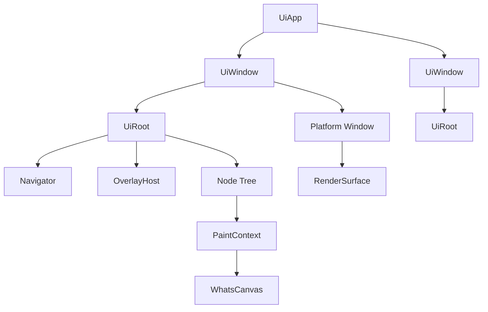
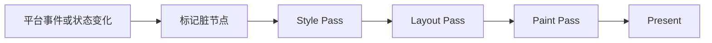

# WhatsUI 架构草案

状态：Draft v0.1

结构化拆分文档见 `doc/whatsui/README.md`。

这份文档保留为统一总纲；后续长期维护优先以 `doc/whatsui/` 下的索引和 ADR 为准。


## 1. 定位

WhatsUI 是一个基于 WhatsCanvas 的轻量原生 UI 框架，目标是覆盖桌面工具界面、设置面板、启动器、调试器面板、嵌入式 UI 这类场景。

它的目标不是成为另一套 Qt、Flutter、Electron 或浏览器式应用平台，而是提供一套边界清晰、可测试、可跨平台的 2D UI 运行时。

## 2. 设计原则

- 宿主驱动：窗口、消息循环、平台初始化和 surface 由宿主负责，WhatsUI 只依赖一层稳定的 host 抽象。
- 单树保留：内部采用长期存在的 `Node` 树，不做虚拟 DOM，也不做 Flutter 式多主树设计。
- 约束布局：布局模型采用 `Constraints -> Size -> Position`，不引入 CSS 级联与流式规则系统。
- 强类型 API：UI 编写面只走 C++ 强类型组合 API，不引入 XML、QML、HTML 或 CSS 这类额外描述语言。
- 局部更新：状态变化只标记相关节点失效，按需执行 style、layout、paint，而不是整页重建。
- 平台边界最小化：平台层只抽 WhatsUI 真正需要的能力，不抽象整个操作系统世界。
- 多页面、多窗口可支持：但其实现应服从轻量目标，而不是把框架推向平台级复杂度。

## 3. 非目标

- 不做 CSS 引擎。
- 不做浏览器式 URL 路由中心模型。
- 不做完整 accessibility 平台。
- 不做通用脚本运行时。
- 不做和大型应用框架正面竞争的超级平台。

## 4. 系统总览

WhatsUI 的总体结构分成 5 层：

1. 应用层：`UiApp`、共享服务、全局状态与命令。
2. 窗口层：`UiWindow`、`UiRoot`、窗口级导航、窗口级浮层、焦点域。
3. 运行时层：`Node` 树、状态失效、布局、事件路由、绘制调度。
4. 渲染接入层：`PaintContext`、layer/cache、对 WhatsCanvas 的调用边界。
5. 平台层：窗口宿主、surface、输入、IME、剪贴板、光标、DPI。



关键边界：

- `UiApp` 管多个窗口和共享服务，但不直接介入页面布局和绘制细节。
- `UiWindow` 是独立 UI 域，拥有自己的 root、焦点、导航、浮层、surface。
- `Node` 树只存在于某一个窗口中，不能跨窗口共享。

## 5. 建议的模块布局

建议在仓库中采用如下模块组织：

```text
src/
  whatsui/
    foundation/
    core/
    layout/
    input/
    paint/
    style/
    widgets/
    navigation/
    platform/
    runtime/
tests/
  whatsui/
doc/
  whatsui/
```

模块职责建议如下：

- `foundation`：几何、颜色、时间、ID、基础容器、小型工具类型。
- `core`：`Node` 树、dirty flags、生命周期、调度器。
- `layout`：constraints、测量协议、基础容器布局算法。
- `input`：事件模型、命中测试、焦点管理、手势基础设施。
- `paint`：`PaintContext`、layer、cache、custom paint 扩展点。
- `style`：theme、token、resolved style、control state。
- `widgets`：标准控件与复合控件。
- `navigation`：页面、导航栈、浮层、窗口关系。
- `platform`：宿主接口与平台适配实现。
- `runtime`：把窗口、事件、布局、绘制串起来的运行时装配层。

## 6. 核心对象模型

### 6.1 UiApp

`UiApp` 是应用级入口，负责：

- 管理 `UiWindow` 列表。
- 持有共享主题、字体缓存、图片缓存、命令总线或共享状态容器。
- 提供打开新窗口、关闭应用、全局服务访问等能力。

`UiApp` 不负责：

- 页面布局。
- 页面级事件分发。
- 直接操作底层 `Canvas`。

### 6.2 UiWindow

每个 `UiWindow` 代表一个独立窗口内的 UI 世界，至少包含：

- `UiRoot`
- `Navigator`
- `OverlayHost`
- `FocusManager`
- `RenderSurface`
- `WindowContext`

`UiWindow` 是以下语义的天然边界：

- 焦点域
- 鼠标 capture 域
- 输入法会话域
- 导航栈域
- 浮层域

### 6.3 Node

`Node` 是 WhatsUI 运行时的唯一核心节点抽象。一个节点至少需要承担以下职责：

- 测量：`measure(const Constraints&) -> Size`
- 布局：`layout(const Rect&)`
- 绘制：`paint(PaintContext&)`
- 命中测试：`hitTest(Point)`
- 事件处理：`onEvent(const Event&)`

建议树所有权使用 `std::unique_ptr<Node>`，保持父子所有权清晰。

建议将节点分成三个层次：

- `Node`：基础布局/绘制节点。
- `Container`：拥有 children 的节点。
- `Control`：拥有 hover/pressed/focused/disabled 等交互态的节点。

仅在确有需要时，再补 `CustomPaintNode` 作为更底层绘制扩展点。

## 7. 生命周期与失效模型

建议页面或节点的可见生命周期只保留少量稳定钩子：

- `onAttach()`
- `onAppear()`
- `onDisappear()`
- `onDetach()`

建议统一以下失效标记：

- `NeedsStyle`
- `NeedsLayout`
- `NeedsPaint`
- `NeedsCompositing`

失效规则建议：

- 纯颜色、边框、阴影变化通常进入 `NeedsPaint`。
- 尺寸、padding、font size、child 增删通常进入 `NeedsLayout`。
- 主题切换通常从 `NeedsStyle` 开始，再按需要升级到 layout 或 paint。
- 是否需要离屏层、缓存层变化进入 `NeedsCompositing`。

## 8. 更新与渲染流水线

一帧建议固定为以下顺序：



设计要求：

- 状态变化不应触发整页重建。
- 动态子树变化应局限在局部结构容器内部。
- 页面作者不应直接感知 dirty flags、surface 或缓存细节。

## 9. 布局模型

WhatsUI 建议使用约束布局模型：

- 父节点向子节点下发 `Constraints`。
- 子节点返回自己的 `Size`。
- 父节点最终给出每个子节点的布局位置。

基础容器建议优先做：

- `Row`
- `Column`
- `Stack`
- `Padding`
- `Align`
- `ScrollView`

坐标与尺寸建议统一使用逻辑单位；平台层负责：

- `logicalSize`
- `framebufferSize`
- `scaleFactor`

布局始终基于逻辑单位，渲染时再由 `PaintContext`/surface 进入物理像素空间。

## 10. UI 编写模型

页面写法建议采用“页面对象 + 组合式 builder + 局部状态”的模型。

示意风格：

```cpp
class SettingsPage {
public:
    ui::NodePtr build(ui::UiContext& ctx) {
        return ui::Column()
            .padding(16)
            .gap(8)
            .child(ui::Text("Settings"))
            .child(
                ui::Button("Close")
                    .onClick([&] { ctx.nav().pop(); })
            );
    }
};
```

建议页面作者主要依赖：

- 标准布局容器
- 标准交互控件
- `State<T>` / `Binding<T>`
- `Theme` / `Style`
- `UiContext` 暴露的高层服务

不建议页面作者直接依赖：

- 原生平台窗口对象
- 底层图形 API
- dirty flags
- layer/cache 管理细节

## 11. 状态与动态结构

建议提供很薄的状态层：

- `State<T>`：可观察值
- `Binding<T>`：双向绑定
- `Computed<T>`：按需提供派生值

### 11.1 设计目标

这一层的目标不是提供一个通用响应式框架，而是为 UI 节点提供最小、稳定、可预测的状态更新机制。

设计要求：

- 状态更新默认发生在 UI 线程。
- 状态变化只通知依赖它的节点或结构容器。
- 局部数据变化不触发整页重建。
- 动态结构变化由显式结构控件托管，而不是交给全树 diff。
- 状态层不感知渲染后端，不直接操作 `Canvas`。

### 11.2 State<T>

`State<T>` 是最基础的可观察值类型，建议具备以下语义：

- `get()`：读取当前值。
- `set()`：写入新值；若值等价则不触发更新。
- `subscribe()`：供节点、结构控件或绑定对象订阅。
- `unsubscribe()`：在节点或结构容器销毁时解除订阅。

建议约束：

- `State<T>` 默认不承诺线程安全；跨线程写入应通过应用调度器切回 UI 线程。
- `set()` 不应立即强制执行 layout/paint，而是标记相关节点失效，由下一帧调度统一处理。
- `State<T>` 可以独立存在于页面对象、应用状态对象或窗口状态对象中，不依赖节点生命周期。

### 11.3 Binding<T>

`Binding<T>` 解决的是控件与状态的连接问题，尤其适合：

- `TextInput`
- `Checkbox`
- `Switch`
- `Slider`
- `SegmentedControl`

建议 `Binding<T>` 支持两类来源：

- 直接绑定 `State<T>`
- 绑定自定义 getter/setter 适配器

这样控件不需要知道状态是来自页面局部变量、共享状态容器，还是应用级服务。

### 11.4 Computed<T>

`Computed<T>` 只应承担轻量派生值职责，例如：

- 将 `State<int>` 转为显示文本
- 根据多个布尔状态决定某段 UI 是否可用
- 从当前主题和页面模式推导某个样式值

建议边界：

- 不把 `Computed<T>` 发展成通用数据流图系统。
- 不引入复杂的自动依赖追踪机制。
- 只服务于页面和控件的局部表达需求。

### 11.5 结构控件

动态结构建议通过显式结构控件表达，而不是整页 diff：

- `If`
- `Switch`
- `ForEach`
- `SlotHost`

这些结构控件负责：

- 管理受控子树的创建和销毁
- 处理局部结构变化
- 将变化限制在局部树范围内

建议进一步明确其语义：

- `If`：根据布尔状态决定某个子树是否挂载。默认 false 时销毁子树，后续可选补 `keepAlive` 策略。
- `Switch`：根据枚举或离散值在多个分支间切换。建议默认只挂载当前分支。
- `ForEach`：根据有序集合生成一组 keyed 子节点。必须要求稳定 key，不建议默认用索引作为 identity。
- `SlotHost`：为导航、页面占位、插件扩展点或延迟挂载保留稳定插槽。

### 11.6 ForEach 的 key 规则

`ForEach` 是最容易把轻量框架拖向隐藏复杂度的地方，所以建议早期就把规则写死：

- 每个元素必须有稳定 key。
- 只有 key 相同的元素才允许复用原有子树。
- 不保证无 key 列表的最优复用行为。
- 默认支持插入、删除、重排，但不承诺做通用最优 diff。

这意味着 `ForEach` 的职责是“托管一组 keyed 子树”，而不是实现另一套虚拟 DOM。

### 11.7 更新规则

状态与结构控件配合时，建议遵守以下规则：

- 值变化先标记依赖节点或结构容器失效。
- 若变化只影响文案、颜色、透明度等，优先落到 `NeedsPaint`。
- 若变化影响尺寸、child 集合、可见结构，升级到 `NeedsLayout`。
- 结构控件内部负责子树 attach/detach，不把局部结构变化扩散到无关分支。
- 事件处理阶段允许修改状态；绘制阶段不允许直接改树，应延迟到事件或调度阶段处理。

### 11.8 生命周期与结构变化

结构控件创建或移除子树时，应遵守统一生命周期语义：

- 子树首次被挂载时触发 `onAttach()`。
- 子树首次进入可见状态时触发 `onAppear()`。
- 子树从当前可见结构中移除时触发 `onDisappear()`。
- 子树被结构控件彻底销毁时触发 `onDetach()`。

这能保证：

- `If` 切换时页面作者能稳定感知挂载与销毁。
- `Switch` 分支切换时行为一致。
- `ForEach` 元素复用和销毁有明确规则。

### 11.9 页面作者视角的写法

页面作者应尽量把动态结构写成显式声明，而不是手工管理节点插拔。示意：

```cpp
State<bool> showAdvanced{false};
State<std::vector<Item>> items;

auto panel = ui::Column()
  .child(
    ui::SwitchRow("Advanced")
      .bind(showAdvanced)
  )
  .child(
    ui::If(showAdvanced)
      .then(advancedPanel())
  )
  .child(
    ui::ForEach(items, [](const Item& item) {
      return buildItemRow(item);
    })
  );
```

这个模型的核心收益是：

- 页面代码表达的是结构意图，而不是节点调度细节。
- 框架能把结构变化限制在最小范围。
- 后续即使加入缓存或更细粒度优化，也不需要推翻 API 形态。

## 12. Theme、Style 与复合控件

建议样式系统分三层：

- `Theme`：全局 token
- widget style：`TextStyle`、`BoxStyle`、`ButtonStyle`
- control state：`normal`、`hover`、`pressed`、`focused`、`disabled`

### 12.1 设计目标

这一层的目标是让页面作者能够稳定地控制视觉表现，同时避免框架滑向 CSS 或大型 design system 引擎。

设计要求：

- 样式必须强类型。
- 默认值必须可预测。
- 局部覆盖必须简单直接。
- 交互态样式必须是控件级能力，而不是全局选择器系统。
- 复合控件应优先通过组合已有控件获得统一视觉，而不是复制样式细节。

### 12.2 Theme Token

建议 token 至少覆盖：

- colors
- spacing
- typography
- radius
- elevation

建议 `Theme` 先保持小而稳，不要一开始塞入大而全的 token 矩阵。比较合理的起点是：

- `ColorTokens`
- `SpacingTokens`
- `TypographyTokens`
- `RadiusTokens`
- `ElevationTokens`
- `MotionTokens`

其中：

- `ColorTokens` 负责 surface、text、accent、border、danger、success 这类语义色。
- `SpacingTokens` 负责统一间距与内边距节奏。
- `TypographyTokens` 负责标题、正文、说明文字、按钮文字等文本层级。
- `RadiusTokens` 负责圆角等级，而不是让页面作者到处写裸值。
- `ElevationTokens` 负责阴影层级和视觉层次。
- `MotionTokens` 可选，负责过渡时长和 easing，不必在 v1 就做复杂动画体系。

### 12.3 Widget Style

`Theme` 解决的是全局视觉语言，widget style 解决的是单个控件的具体参数。

建议至少拆出：

- `TextStyle`
- `BoxStyle`
- `ButtonStyle`
- `InputStyle`
- `ScrollStyle`

建议边界：

- `TextStyle` 只关心字体、字号、行高、字重、颜色、对齐等文本参数。
- `BoxStyle` 负责背景、边框、圆角、阴影、内边距等容器视觉参数。
- `ButtonStyle` 在 `BoxStyle` 基础上增加不同 control state 的视觉规则。
- `InputStyle` 负责边框、光标、选区、placeholder、错误态等输入组件样式。
- `ScrollStyle` 负责滚动条可见性、厚度、颜色、圆角等非核心内容。

### 12.4 样式覆盖顺序

建议尽早定死样式解析顺序，避免后面行为变得不可预测。推荐顺序：

1. 框架默认样式
2. 当前 `Theme` token 展开后的默认 widget style
3. widget variant
4. 控件实例级显式 `style()` 覆盖
5. control state 在当前样式上的状态态调整

这个顺序的含义是：

- `Theme` 定视觉语言
- variant 定语义角色
- 实例 `style()` 定局部例外
- 交互态在最终结果上做状态修正

### 12.5 Variant 体系

建议为常用控件提供少量稳定 variant，而不是鼓励每个页面到处手工配色。

例如按钮：

- `Primary`
- `Secondary`
- `Tonal`
- `Danger`
- `Ghost`

例如容器：

- `Surface`
- `SurfaceAlt`
- `Outline`
- `Elevated`

variant 的职责是把“语义角色”映射成一组稳定视觉规则，而不是替代全部样式能力。

### 12.6 Control State

明确建议支持以下 control state：

- `normal`
- `hover`
- `pressed`
- `focused`
- `disabled`

必要时可补：

- `selected`
- `checked`
- `invalid`

建议这些状态的样式由控件内部统一解析，不暴露为外部选择器系统。也就是说，页面作者可以配置状态态样式，但不需要学习一套类 CSS 的匹配语法。

### 12.7 Theme 的作用域

建议主题至少支持两层作用域：

- 应用级主题：由 `UiApp` 提供默认主题。
- 子树级主题覆盖：允许局部页面或复合控件在某棵子树内覆盖主题。

不建议 v1 就引入复杂的多层 theme merge 规则。较稳妥的做法是：

- 允许整组 token 替换
- 允许少量显式 patch
- 不鼓励无限层级的隐式叠加

### 12.8 复合控件策略

明确不做：

- CSS cascade
- selector engine
- 字符串样式表

复合控件建议优先通过组合已有控件完成，仅在必要时再继承 `Control` 或 `Container`。

建议将复合控件分成两类：

- 纯视觉复合控件：例如 `Card`、`Toolbar`、`SectionHeader`
- 语义交互复合控件：例如 `SettingsRow`、`SwitchRow`、`DialogFooter`

对于复合控件，建议遵守：

- 对外暴露少量高价值参数。
- 内部尽量复用标准容器、标准文本和标准交互控件。
- 尽量复用现有 `Theme` token 和 widget style，不复制硬编码视觉常量。

### 12.9 页面作者的写法

页面作者更理想的体验应当是：

```cpp
auto saveButton = ui::Button("Save")
  .variant(ui::ButtonVariant::Primary)
  .style(ui::ButtonStyle{
    .minWidth = 96,
  });

auto section = ui::Card()
  .variant(ui::CardVariant::SurfaceAlt)
  .child(
    ui::Column()
      .gap(ui::theme().spacing.medium)
      .child(ui::Text("General").style(ui::Theme::sectionTitle()))
      .child(saveButton)
  );
```

页面作者表达的是：

- 这个控件属于什么语义角色
- 在默认主题上有哪些局部覆盖
- 控件之间如何复用统一样式节奏

而不是去关心某个按钮 hover 时到底应该把 alpha 改成多少。

### 12.10 样式系统的边界

建议明确这套样式系统不承担以下职责：

- 运行时解析字符串样式规则
- 做跨页面全局选择器匹配
- 支持浏览器级联和继承语义
- 提供无限扩展的设计 token 图谱

它的职责更聚焦：

- 为 WhatsUI 提供统一视觉语言
- 为标准控件提供稳定默认样式
- 为页面作者提供直接、可控的局部覆盖方式
- 为复合控件提供可复用、可维护的样式基础

## 13. 导航、浮层与多窗口

建议始终明确三层概念：

- Page：同一窗口里的内容切换
- Overlay：同一窗口里的临时浮层
- Window：独立 root、surface、focus、IME 域

`Navigator` 建议只负责页面栈：

- `push()`
- `replace()`
- `pop()`
- `popToRoot()`
- `canPop()`

建议支持页面保活策略：

- `KeepAlive`
- `DisposeOnHide`

`OverlayHost` 建议独立于 `Navigator`，负责：

- dialog
- menu
- toast
- tooltip
- popover

多窗口建议由 `UiApp` 统一管理，窗口之间：

- 不共享 `Node` 实例
- 不共享页面实例
- 通过 app state 或 command bus 通信

## 14. 平台抽象

平台层建议只暴露 WhatsUI 需要的最小宿主能力。

建议接口包括：

- `IPlatformApp`
- `IPlatformWindow`
- `IRenderSurface`
- `ITextInputSession`
- `IClipboard`
- `ICursorService`

### 14.1 IPlatformApp

负责：

- 创建窗口
- owned loop 运行
- 退出应用

建议同时支持：

- owned loop
- embedded loop

### 14.2 IPlatformWindow

负责：

- 窗口标题、显示、关闭
- 获取 `logicalSize`、`framebufferSize`、`scaleFactor`
- 暴露 surface、剪贴板、光标、IME 等窗口级服务

### 14.3 IRenderSurface

建议抽象为：

- `beginFrame()`
- `endFrame()`
- `resize()`
- 查询 backend 和 framebuffer 尺寸

这使得：

- 桌面运行时可接 OpenGL/GLES
- 回归测试可接 Software backend
- 以后可在不动 UI core 的前提下接入新 backend

### 14.4 文本输入与 IME

建议将 IME 会话独立为 `ITextInputSession`，而不是混进键盘事件：

- `activate()`
- `deactivate()`
- `setCaretRect()`
- `setSurroundingText()`

键盘事件与文本输入事件应保持分流。

## 15. 验证与测试策略

WhatsUI 的重要优势之一，是可以直接利用 WhatsCanvas 的 Software backend 建立稳定测试。

建议覆盖：

- golden image 回归
- 布局 snapshot 测试
- 事件流测试
- 多窗口与导航行为测试
- 文本、DPI、阴影、裁剪等视觉回归

原则：

- UI 不是只验证“能跑起来”
- 要验证布局是否稳定、输入是否正确、视觉是否回归

## 16. 推荐实现顺序

建议按以下顺序落地：

1. `foundation` + `core`：`Node`、dirty flags、frame pipeline。
2. `layout`：constraints 与基础容器。
3. `paint` + `runtime`：`PaintContext` 与 surface/frame 串接。
4. `platform`：最小 host 壳。
5. `widgets`：Text、Button、Container、ScrollView 等基础控件。
6. `navigation`：Navigator、OverlayHost、UiWindow 关系。
7. `State<T>` / `Binding<T>` / 结构控件。
8. `Theme` 与复合控件体系。
9. 文本输入、IME、多窗口增强。

## 17. 待决策问题

以下问题在实现前仍值得单独决策：

- 页面参数是否默认采用强类型 page factory，而不是命名 route。
- 页面 builder 是否引入独立 `NodeSpec`，还是直接包装 `unique_ptr<Node>`。
- 参考宿主实现优先选 GLFW、SDL，还是直接做更原生的 desktop host。
- `TextInput` 是否在早期架构阶段仅定义接口，不立即落完整实现。
- layer/cache 在 v1 是否仅保留接口和脏位，不立即做复杂优化。

## 18. 总结

WhatsUI 的核心不是“做更多功能”，而是把边界收稳：

- 小而清晰的宿主抽象
- 单树保留运行时
- 强类型 C++ UI 编写方式
- 可支持多页面与多窗口
- 借助 WhatsCanvas 获得稳定文本与渲染底座
- 借助 Software backend 获得可靠测试手段

只要这些边界保持稳定，WhatsUI 就能在不演化成大型框架的前提下，逐步长成一套扎实的桌面 UI 系统。