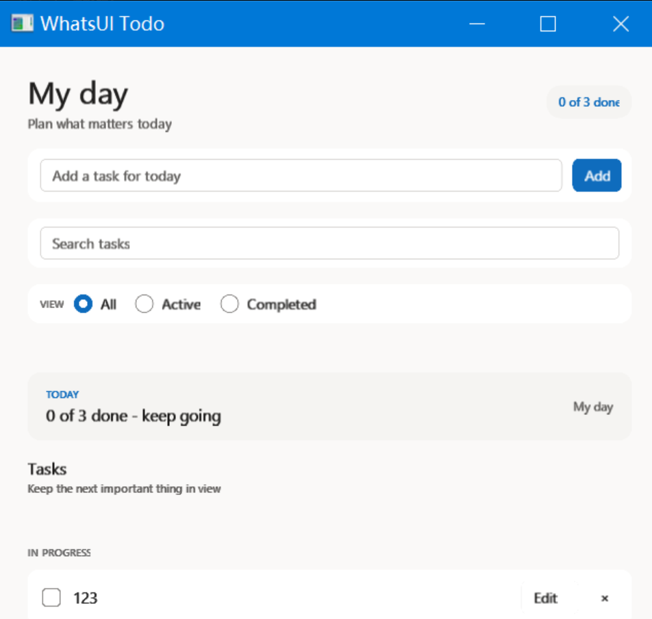
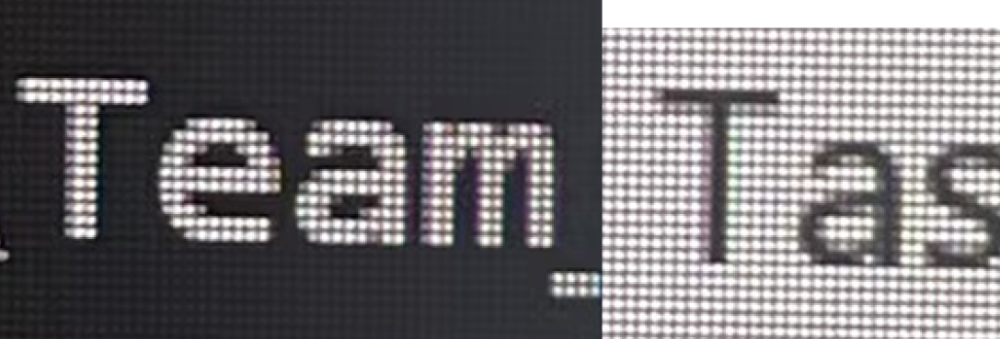
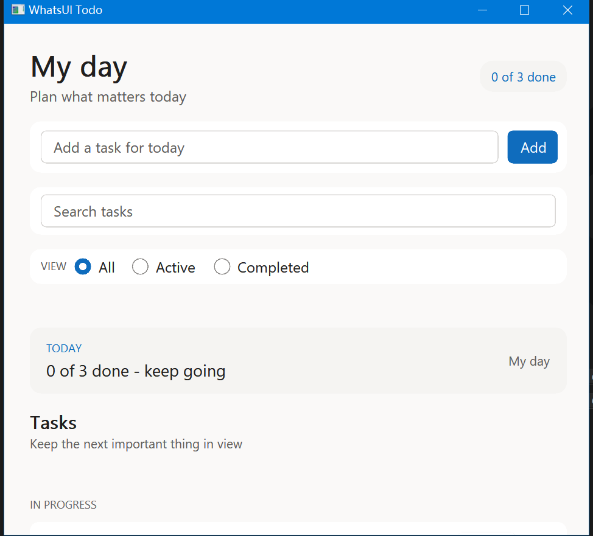
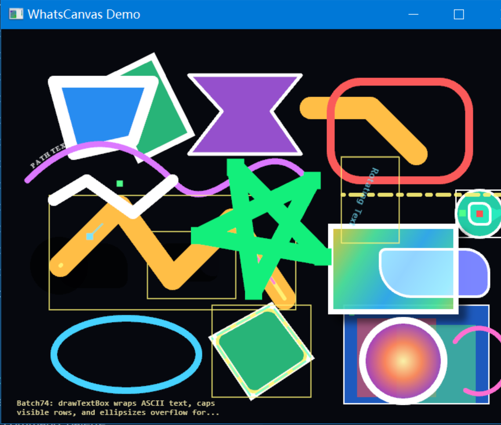
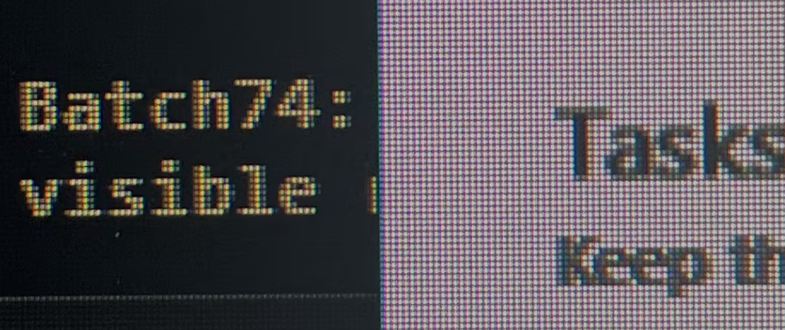
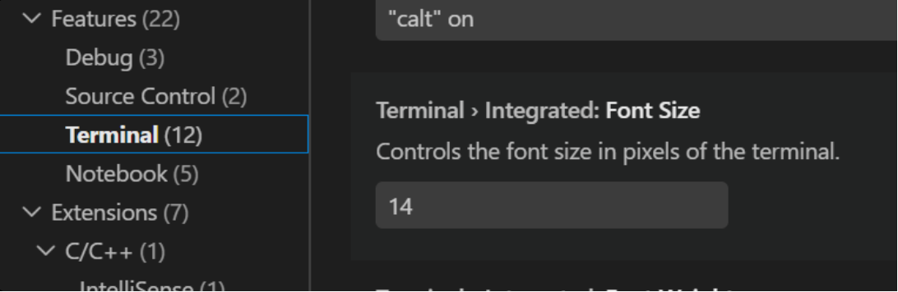
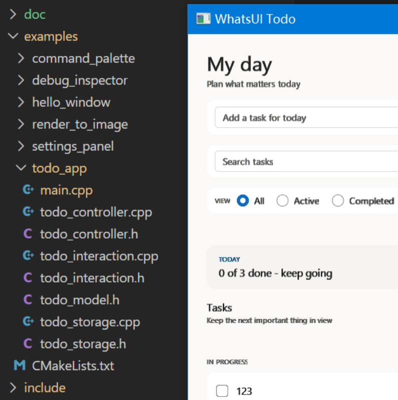

# Windows 文字渲染发虚问题：根因、修复与回归保护

> 状态：已修复并通过 Windows 4K / 150% 缩放实机验证
> 适用范围：WhatsUI Todo、WhatsCanvas OpenGL 文字位图路径、Windows GLFW 平台层
> 最后更新：2026-07-14

图片说明：`doc/images` 中的界面截图和显示器近摄照片由用户在本次排查中提供。显示器照片包含相机曝光、摩尔纹、前景/背景反相等变量，只用于呈现现象；真正的回归结论以应用直接 framebuffer capture 和自动化像素测试为准。当前修复仍在未提交 working tree 中，因此本文用构建目录、测试和文件位置标识版本，不虚构 commit id。

## 1. 摘要

Todo 曾长期存在文字发虚、字号偏小的问题。排查期间又短暂产生过一个比原始版本更糟的“过渡期坏构建”。必须把时间线分开：

1. **原始基线**：GDI RGB coverage 被折叠成单 Alpha mask。它不是真正的 ClearType，但普通 Alpha 合成自洽；主要问题是 Windows 150% 被误判为 100%，且字重/斜体属性未完整传到 GDI。
2. **过渡期坏构建**：NativeText 已开始保留 RGB coverage，Canvas 却仍禁用了 ClearType compositor。RGB coverage 又被普通 Alpha 乘一次，造成最明显的半透明、发虚字干。`todo_demo_before.png` 记录的是这一阶段。
3. **最终修复**：RGB coverage 进入 dual-source compositor；Windows 使用真实 content scale；字重参与测量、缓存和绘制。

修复后，ClearType 的 RGB 覆盖能够穿过纹理上传、采样和 OpenGL 混合链路；Windows 150% 缩放会把 640×560 logical DIP 窗口正确映射为约 960×840 physical px；标题字重也会参与测量、缓存与绘制。Todo 从“明显发虚”提升到了可用的 Windows 原生文字质量。

## 1.1 术语与坐标约定

| 术语 | 本文含义 |
|---|---|
| DPR / content scale | Windows monitor DPI 相对 96 DPI 的比例；150% 即 1.5 |
| DIP / logical px | WhatsUI 布局、事件和控件尺寸使用的逻辑单位；Windows 上 1 DIP 在 150% 时对应 1.5 physical px |
| physical px / ppem | framebuffer 像素，以及字形实际参与 raster 的每 em 物理像素数 |
| RGB coverage | LCD 文字对 R/G/B 子像素分别计算的覆盖率 |
| Alpha mask | 三通道共享一个覆盖值的灰度抗锯齿 mask |
| layout metrics | 用于排版的宽、高、ascent/descent；可以是小数 |
| bitmap quad | 把文字位图贴到 framebuffer 的矩形几何 |
| `SRC_OVER` | 前景覆盖背景的标准 Porter-Duff 合成模式 |
| dual-source blending | fragment shader 同时输出前景颜色和 RGB coverage，使 OpenGL 按通道混合 |
| slant | Normal、Italic、Oblique 等字体倾斜属性 |

## 2. 现象与视觉证据

### 2.1 修复前：整页文字模糊、字干发灰

下图是排查期间的过渡期 Todo 构建：NativeText 已保留 RGB coverage，Canvas 仍走普通 Alpha 路径。标题、输入框、筛选项和正文都比同一显示器上的 VS Code 更软，细字号尤其明显。



从显示器像素的近距离照片看，Todo 中 `Tasks` 的 `T` 顶部横画只有“一行强覆盖 + 一行部分覆盖”，视觉上约为 1.5 个像素；VS Code 对照文字的横画更完整。



### 2.2 修复后：真实 150% 栅格化与正确字重

修复后的 Todo 使用真实 Windows content scale。640×560 logical DIP 在 150% 显示器上对应约 960×840 physical px，字号、控件和间距一起按 DIP 语义缩放，而不是只放大最终窗口位图。



### 2.3 为什么 WhatsCanvas Demo 看起来一直更清楚

WhatsCanvas Demo 的底部文字使用 Consolas 12px，并且旧路径采用自洽的普通 Alpha mask 合成。虽然它没有完整保留 RGB ClearType 覆盖，但不会把 RGB coverage 再乘一次 Alpha，因此视觉上反而比过渡期 Todo 更清楚。



显微照片也显示 WhatsCanvas Demo 与过渡期 Todo 的像素覆盖不同。不过这不是严格的同条件比较：Demo 使用 Consolas，Todo 使用 Segoe UI；字号、背景色和字重也不同。



## 3. 对照实验中的易错点

### 3.1 VS Code 截图中的“14”不是工作台 UI 字号

下面截图里的 `14` 是 `Terminal > Integrated: Font Size`，只控制终端内容，不控制左侧设置目录和 VS Code 工作台 UI。



本机 VS Code Insiders 1.128 的实际条件通过 `workbench.desktop.main.css`、用户 `settings.json` 和已安装字体回退核对；用户配置中没有 `window.zoomLevel` 或 workbench font override。结果是：

- 字体：`Segoe UI`（`Segoe WPC` 不可用时的回退）。
- 默认字号：13 CSS px。
- 选中的 `Terminal` 目录项：700 字重。
- Windows 150% 下的名义物理字号：约 19.5 px。
- 渲染器：Chromium/Skia + DirectWrite LCD 路径。

过渡期 Todo 的实际条件则是：

- 字体：Segoe UI。
- `Tasks`：20 px，但错误 DPR 使它只有约 20 physical px。
- 字重：期望为标题字重，实际被 GDI 强制为 Regular 400。
- 渲染器：GDI `TextOutW` 生成位图，再由 OpenGL 合成。

因此最初的照片实质上比较的是 `VS Code 19.5px / 700` 与 `Todo 20px / 400`。这足以造成 2px 与约 1.5px 的横画差异，不能据此单独判断纹理是否被二次缩放。

### 3.2 文件树对照也不是同字号、同字重实验



这张图能证明 Todo 的整体观感存在问题，但不能精确归因，因为两侧的字号、字重、背景、字体角色和渲染后端均不同。后续像素验收必须固定这些变量。

### 3.3 两条 Windows raster 路径的边界

| 路径 | Raster 来源 | 与另一条路径共用的后半段 | 独有问题 |
|---|---|---|---|
| 默认 Todo | GDI `CreateFontW + TextOutW` → cached RGBA bitmap | texture upload、pixel snap、Nearest、ClearType eligibility、dual-source blend | GDI weight/slant 传播和 NativeText cache key |
| DirectWrite 诊断模式 | DirectWrite layout + D2D/WIC → RGBA bitmap | texture upload、pixel snap、Nearest、ClearType eligibility、dual-source blend | WIC opaque target、fractional metrics 与整数 bitmap quad |

原始 Todo 的两个长期问题是 Windows 平台层误判 DPR，以及默认 GDI 路径丢失字重/斜体；第 4 节是排查期间因“只更新 NativeText、未更新 Canvas”引入的合成回归。第 7 节记录的是 DirectWrite 诊断路径中同时发现并修复的独立缺陷，不能反推它们都是原始 Todo 症状的原因。

## 4. 排查期回归：RGB ClearType 覆盖被重复衰减

### 4.1 GDI 位图包含什么

Windows GDI `TextOutW` 在 32-bit DIB 中写入 B/G/R 三个独立的 LCD 覆盖通道。旧代码把它们折叠为：

```text
RGB = (255, 255, 255)
Alpha = max(R, G, B)
```

这种做法丢失了真正的 RGB 子像素覆盖，但用普通 `SRC_ALPHA` 合成时是自洽的。

第一轮改动开始保留原始 RGB coverage：

```text
RGBA = (R, G, B, max(R, G, B))
```

这一步本身是正确的，但暴露了 Canvas 的另一个错误。

### 4.2 过渡期坏二进制为什么比原来更糊

Canvas 的普通文字填充错误地调用了等价于：

```cpp
submitBitmapText(fillColor, currentMatrix, /* useFillShader = */ true);
```

`useFillShader=true` 会让 `clearTypeMask` 永远为 false。于是包含 RGB coverage 的纹理落入普通图片 Shader 和 `SRC_ALPHA` 混合。设 `Ccov` 为三通道 coverage、`amax=max(Ccov)`、`Cfg/Cdst` 为前景/背景，实际输出是：

```text
Cout = Cfg × Ccov × amax + Cdst × (1 - amax)
```

这不是正确的按通道 ClearType 公式：前景 coverage 被统一 Alpha 再乘一次，背景也只按 `amax` 而不是各自通道衰减；接近黑色的 Todo 文字会丢失主要 RGB coverage 差异。再叠加 Linear sampling 和未吸附 bitmap origin，边缘表现为发灰、发软。用户当时运行的 `build-native-text-compare` 正好是这种“NativeText 已更新、Canvas 尚未更新”的过渡期二进制。

### 4.3 修复方法

普通文字只有在真正存在渐变时才启用 fill shader：

```cpp
submitBitmapText(
    fillColor,
    currentMatrix,
    paint.hasLinearGradient() || paint.hasRadialGradient());
```

ClearType 合格路径同时执行以下约束：

- 仅允许不透明、无阴影、无描边、无渐变的 `SRC_OVER` 文字。
- 保留 RGB coverage，不转换成单 Alpha mask。
- 使用 `Nearest`，避免 LCD texel 在相邻物理像素间插值。
- 将 bitmap 起点吸附到物理像素网格。
- 使用 dual-source blending：

```text
source0.rgb = foreground.rgb × coverage.rgb
source1.rgb = coverage.rgb
out.rgb = source0.rgb + destination.rgb × (1 - source1.rgb)
```

这样每个颜色通道都用自己的 LCD 覆盖合成，不会再被统一 Alpha 二次衰减。

dual-source 路径还依赖桌面 OpenGL 报告 `GL_MAX_DUAL_SOURCE_DRAW_BUFFERS >= 1`。OpenGL ES 或不支持 dual-source 的设备不能宣称获得同等 LCD 合成效果，必须降级到普通 Alpha/grayscale mask；ClearType 也只适用于最终已知不透明的桌面 framebuffer。当前 Windows Todo 的白色/浅色卡片均在不透明窗口表面绘制，满足该前提。

这里还有一个必须保留的实现边界：当前 `Canvas` 的 ClearType eligibility 检查了文字前景、特效、变换和混合条件，但尚未显式证明当前 render target/saveLayer 是不透明的。上述公式只描述不透明目标上的 RGB 合成；透明离屏层不能直接复用该路径。后续引入透明窗口、透明导出或 `saveLayer` 文字时，应把“目标已知不透明”纳入资格判断，否则强制回退到 grayscale/普通 Alpha。

## 5. 长期根因一：Windows 150% 被错误识别为 100%

### 5.1 错误计算

旧 GLFW 平台层使用：

```cpp
scaleFactor = framebufferWidth / windowWidth;
```

这在 macOS Retina 上可以反映 framebuffer 与窗口坐标的差异，但 Win32 GLFW 的 window size 和 framebuffer size 通常都是物理像素，二者保持 1:1。结果是：

```text
Windows 设置：150%
原始及过渡期 Todo scaleFactor：1.0
Tasks 20 logical px 实际栅格：约 20 physical px
```

这解释了为什么修改显示器缩放后 Todo 文字仍然偏小，也解释了为什么 `T` 顶横画只有约 1.5px。

### 5.2 正确的平台契约

Windows 现在从 `glfwGetWindowContentScale` 读取 DPR，并配套修正整条坐标链：

1. 必须在 `glfwInit` 和任何 HWND 创建之前启用 Per-Monitor V2 DPI awareness；否则 Windows 可能先对整个窗口做兼容性 bitmap scaling。
2. 创建窗口时启用 GLFW 3.3+ 的 `GLFW_SCALE_TO_MONITOR`。GLFW API 仍称其单位为 screen coordinates；在 Win32 实现中该 hint 会按 monitor content scale 放大请求的 client size，WhatsUI 再以 `physical/contentScale` 建立 logical DIP 契约。
3. `WindowMetrics.logicalSize = windowPhysicalSize / contentScale`。
4. `WindowMetrics.framebufferSize` 保留物理像素。
5. Canvas 根变换使用 content scale，使文字在物理字号下重新栅格化。
6. 鼠标坐标除以 content scale 后再进入 WhatsUI 命中测试。
7. IME caret 从 logical DIP 投影回 Win32 client physical px。
8. 注册 content-scale callback，跨显示器或 DPI 改变时重新布局与绘制。

修复后的关系是：

```text
Windows 设置：150%
Todo scaleFactor：1.5
窗口：640×560 logical DIP → 960×840 physical px
Tasks：20 logical px → 30 physical px raster
```

实机 framebuffer 检查中，修复后的 `T` 顶横画出现两行完整强覆盖，并保留额外的抗锯齿边缘覆盖。

## 6. 长期根因二：字重在 WhatsUI → GDI 链路中丢失

WhatsCanvas 的 `Paint` 原本支持 CSS 风格的 `fontWeight`，DirectWrite 后端也能读取它，但 WhatsUI 和 GDI 路径没有完整接通：

- `wui::Text` 和 `ui::Text` builder 没有 weight 属性。
- `PaintContext::drawText` 没有把 weight 写入 Paint。
- `WhatsCanvasTextMeasurer` 始终按 Regular 测量。
- GDI `CreateFontW` 硬编码 `FW_NORMAL` 和非斜体。
- NativeText cache key 不包含 weight/slant，Regular bitmap 可能被 Bold 请求错误复用。

修复后：

- `wui::Text` 增加 `fontWeight`，builder 支持 `.weight(...)`。
- 绘制、垂直居中测量、换行布局使用同一 weight。
- GDI `CreateFontW` 使用 `paint.getFontWeight()` 和 slant。
- 测量缓存、布局缓存和 NativeText bitmap 缓存都区分 weight。
- Todo 的页面标题和 section heading 使用 600。

这不只是视觉加粗；它修复了设计系统无法表达 Regular/Semibold 层级的基础能力。

## 7. DirectWrite 路径的额外修复

### 7.1 ClearType WIC target 曾导致整页文字消失

DirectWrite ClearType 需要已知不透明的目标。早期实现给 D2D ClearType render target 配置了与 WIC storage 不兼容的像素/Alpha 组合，真实文字 run 创建或绘制失败；OpenGL 仍能画控件背景和 radio/checkbox，所以最终表现为“所有文字消失、只剩组件轮廓”。

修复后的约定是：

- ClearType 使用 opaque BGRX WIC storage。
- D2D render target 使用 `DXGI_FORMAT_B8G8R8A8_UNORM + D2D1_ALPHA_MODE_IGNORE`。
- ClearType target 先清为不透明黑色，再以白色绘制 coverage。
- 读回时按 B/G/R → R/G/B coverage 转换，并由最亮通道派生兼容 Alpha。
- Grayscale 模式继续使用透明 premultiplied target，不与 ClearType 共用错误的 Alpha 契约。

DirectWrite backend 目前仍是显式诊断选项，而不是 Todo 默认值。原因不是清晰度不足，而是当前实现会为每个请求创建 WIC/D2D bitmap，缺少 retained text-run cache；在缓存完善前直接作为默认路径会重新引入输入和点击卡顿。默认 Windows Todo 使用有缓存的 GDI NativeText 路径。

诊断时可使用：

```text
WHATSUI_TEXT_BACKEND=directwrite
WHATSUI_TEXT_RENDER_MODE=cleartype
```

### 7.2 Fractional layout metrics 曾压缩整数 LCD bitmap

DirectWrite 返回的 layout width/height 可以是小数，但位图尺寸必须 `ceil` 为整数。旧 Canvas 用小数 layout metrics 作为最终 quad 尺寸，会把 N 个纹理 texel 压入小于 N 个物理像素，即使使用 Nearest 也会破坏 1:1 映射。

ClearType bitmap quad 现在使用：

```text
quadWidth  = bitmapWidth  / textRasterScale
quadHeight = bitmapHeight / textRasterScale
```

布局测量仍保留 DirectWrite 的小数 metrics；只有最终 LCD 位图使用整数物理像素尺寸。

## 8. 排查过程中出现过的假线索

### 8.1 “DirectWrite 已开启，所以应该清晰”

选择文字后端并不能保证最终清晰。必须验证 raster → texture → sampling → transform → blend → framebuffer 的完整链路。任意一步把 RGB coverage 折叠、插值或重复乘 Alpha，最终都会发虚。

### 8.2 “换成 ClearType quality 就会得到两像素横画”

`CLEARTYPE_QUALITY` 能让 GDI 更偏向像素 grid fitting，但本机实测中，Segoe UI Regular 20px 在 Classic/Natural 两种质量下仍可能是“一行强覆盖 + 一行部分覆盖”。真正让 Todo 得到预期物理字干的是正确 DPR 与字重。

### 8.3 “DirectWrite/Canvas 架构本身有缺陷”

WhatsCanvas Demo 的文字一直清楚，已经反证了“Canvas 天生不能清晰显示文字”。最终问题是 Todo 使用了不同的构建状态、错误 DPR 和不完整的合成/字重链路。

### 8.4 错误的端到端测试也会误导结论

最初的 ClearType Canvas 测试创建了 8×8 GLFW framebuffer，却让 Canvas 按 192×96 绘制和读回。文字被压入错误 viewport，`glReadPixels` 还读取了超出真实 framebuffer 的区域。另一个错误是先 `present/SwapBuffers` 再读 back buffer。

测试已改为真实 288×144 framebuffer，并在 `present` 前读回当前帧。修复后：

- 当前一次实机运行观测：1.0x 为 383 个非白像素，其中 354 个保留 RGB 子像素差异。
- 当前一次实机运行观测：1.5x 为 771 个非白像素，其中 636 个保留 RGB 子像素差异。

Fixture 使用白色不透明背景、黑色 Segoe UI `My day`、18 logical px、DirectWrite ClearType；1.5x 时 raster 为 27 physical px。RGB-different 的判定是：像素不是近白背景，且 `R/G/B` 至少两个通道不同。计数是诊断信息，不作为跨 GPU/字体版本的固定 golden threshold；真正断言是 1.0x 和 1.5x 都必须存在 RGB-different text pixel。另有一个合成的一像素 mask `{64,128,192}`，验证白色背景上的 dual-source 输出约为 `{191,127,63}`，用于区分正确按通道合成和普通灰度 Alpha 合成。

## 9. 复现环境与命令

本次实机环境：

- Windows，3840×2160，系统缩放 150%。
- 系统 Segoe UI 与 ClearType 可用。
- Desktop OpenGL 支持 dual-source blending。
- Todo 默认 GDI NativeText；DirectWrite 仅通过环境变量显式启用。
- 代码处于未提交 working tree；可复现构建目录为 `build-native-text-compare`。

构建并运行当前修复版本：

```powershell
cmake --build build-native-text-compare --config Release --target WhatsUITodoGlfw --parallel 4
.\build-native-text-compare\examples\Release\WhatsUITodoGlfw.exe
```

运行核心回归：

```powershell
ctest --test-dir build-native-text-compare -C Release --output-on-failure `
  -R '^(WhatsCanvasTextBackendContractTests|WhatsCanvasClearTypeCompositingTests|whatsui_text_shaping_tests|whatsui_glfw_resize_tests|whatsui_window_tests|whatsui_todo_interaction_tests|whatsui_todo_ui_interaction_smoke_tests|whatsui_todo_native_perf_smoke)$'
```

直接捕获 Todo client framebuffer，可设置：

```powershell
$env:WHATSUI_DEBUG_CAPTURE_PPM = 'E:\temp\todo-frame.ppm'
.\build-native-text-compare\examples\Release\WhatsUITodoGlfw.exe
```

旧原始基线和过渡期坏构建没有可用的唯一 commit/build id，不能从本文精确重建；对应图片只作为历史现象证据。后续发生类似问题时必须先保存 commit、CMake cache、exe hash、DPI、字体平滑设置和原始 1:1 framebuffer capture。

## 10. 验证与回归保护

当前覆盖以下验证：

| 验证 | 保护内容 |
|---|---|
| `WhatsCanvasTextBackendContractTests` | GDI RGB coverage 保留、ClearType flag、不同字重不串 bitmap cache |
| `WhatsCanvasClearTypeCompositingTests` | 1.0x/1.5x 完整 Canvas 链路保留 RGB coverage |
| `whatsui_text_shaping_tests` | 文字测量缓存区分字重、DPR 下逻辑 metrics 可用 |
| `whatsui_glfw_resize_tests` | framebuffer resize 与 viewport 同步；不覆盖 content-scale 坐标链 |
| `whatsui_window_tests` | 纯函数级 1.5x logical caret → physical IME client 坐标投影；不是完整 native DPI smoke |
| `whatsui_todo_interaction_tests` | Todo 模型交互不受文字改动影响 |
| `whatsui_todo_ui_interaction_smoke_tests` | UI 命中、输入和状态切换保持正确 |
| `whatsui_todo_native_perf_smoke` | Composer、checkbox、radio 在真实窗口中保持响应 |

同时完成以下人工验收：

- Windows 3840×2160、150% 缩放。
- 修复后 Todo framebuffer 为约 960×840，对应 640×560 logical DIP。
- Todo 自身导出的 framebuffer 与屏幕显示一致。
- 放大观察 `Tasks` 的 `T`，顶横画有两行完整强覆盖。
- 输入框、筛选项、摘要、标题和说明文字均可读，没有重新出现空白文字或双重 Alpha 发灰。
- native Todo performance smoke 覆盖了当前 150% 环境中的鼠标交互，但尚未自动证明 content-scale → logical metrics、pointer ÷ scale、content-scale callback 和跨显示器迁移这四项契约；它们仍属于 Windows 发布前人工验收项，后续应补专用 native DPI 回归。

## 11. 后续修改时的验收清单

以后修改文字、主题、窗口或渲染代码时，必须同时检查：

- [ ] 对照双方是否使用相同 font family、physical ppem、weight、背景色和 DPI。
- [ ] Windows DPR 是否来自 content scale，而不是 `framebuffer/window`。
- [ ] logical window、framebuffer、pointer 和 IME caret 是否使用一致的坐标转换。
- [ ] ClearType bitmap 是否保留独立 R/G/B coverage。
- [ ] ClearType 是否只用于不透明前景、已知不透明目标、无特效、轴对齐、1:1 texel 映射的文字；透明 layer 是否已回退到 grayscale/普通 Alpha。
- [ ] ClearType texture 是否使用 Nearest，bitmap origin 是否落在物理像素网格。
- [ ] 普通 fill 是否没有被错误标记为 gradient/fill shader。
- [ ] layout metrics 与 bitmap quad 尺寸是否各司其职，未把整数 LCD 纹理压入小数 physical width。
- [ ] weight/slant 是否同时参与测量、布局、绘制和 cache key。
- [ ] 截图是否来自当前刚构建的 exe，避免再次检查“半新半旧”的过渡期二进制。
- [ ] 端到端 framebuffer 测试是否在真实尺寸上、present 之前读回。

## 12. 关键实现位置

| 文件 | 责任 |
|---|---|
| `third_party/WhatsCanvas/src/text/NativeText.cpp` | GDI 字体创建、RGB coverage 提取、weight/slant |
| `third_party/WhatsCanvas/src/text/BasicTextBackend.cpp` | NativeText cache key 与 bitmap 结果传播 |
| `third_party/WhatsCanvas/src/canvas/Canvas.cpp` | DPR 物理字号栅格、像素吸附、ClearType 合格条件、bitmap quad |
| `third_party/WhatsCanvas/src/command/DrawImage.cpp` | ClearType mask shader 输入与输出 |
| `third_party/WhatsCanvas/src/render/RenderContext.cpp` | dual-source blending 状态 |
| `src/whatsui/platform/glfw_platform.cpp` | Windows content scale、窗口/输入/IME 坐标转换 |
| `include/wui/paint_context.h` | 字体、字号、字重和 baseline 传递 |
| `include/wui/text_metrics.h` | 带字重的测量/布局接口 |
| `include/wui/whatscanvas_text.h` | WhatsCanvas 测量缓存与 Paint 创建 |
| `include/wui/widgets.h`、`include/wui/ui.h` | `Text` 字重属性与 builder API |
| `examples/todo_app/main.cpp` | Fluent Todo 字号、行高和标题字重 |

## 13. 结论

这次问题说明，文字清晰度不能只看“用了什么 API”。真正的质量取决于字体选择、physical ppem、hinting、纹理尺寸、坐标吸附、采样方式、混合公式、DPI 和字重是否在整条链路中保持一致。

默认 Todo 的最终修复不是单纯开启 DirectWrite，也不是单纯保留 RGB，而是同时修正：

```text
RGB coverage 合成
    + 真实 Windows content scale
    + 逻辑/物理坐标契约
    + 字重测量与绘制
```

这些修复共同把默认 GDI Todo 从“看起来经过缩放的位图文字”恢复为按 Windows 物理像素正确栅格化的 UI 文字。DirectWrite 诊断路径另行修复了 opaque WIC target 和 fractional layout metrics 压缩整数 bitmap quad 两个问题；它们是独立的后端缺陷，不是原始 Todo 发虚的原因。
