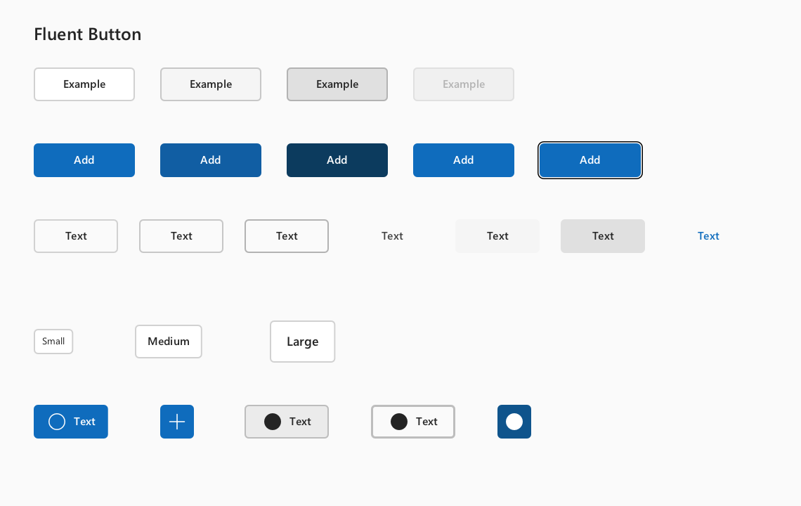

# Fluent Button visual contract

WhatsUI Button follows the Fluent UI React v9 component geometry and state
model. The default control is a Secondary Button; Primary is an explicit
emphasis choice.

## Official references

- [Microsoft Fluent 2 Web Community — Button](https://www.figma.com/design/YmJOnZK9Ftq5Kn1lQXDkuY/Microsoft-Fluent-2-Web--Community---Copy-?node-id=9026-2684)
- <https://storybooks.fluentui.dev/react/?path=/docs/components-button-button--docs>
- <https://github.com/microsoft/fluentui/blob/master/packages/react-components/react-button/library/src/components/Button/useButtonStyles.styles.ts>

The implementation was checked against the editable Figma component state
rows, not only against the Storybook screenshot: text-only states are node
`9026:2787`, text-plus-icon states are `9026:2802`, and icon-only/toggle
states are `9026:2810`. These rows define Rest, Hover, Pressed, Selected,
Focus, and Disabled side by side.

## Geometry and typography

| Size | Width | Height | Horizontal padding | Typography |
| --- | --- | ---: | ---: | --- |
| Small | Content hugging | 24 DIP | 8 DIP | 12/16 Regular |
| Medium | Content hugging | 32 DIP | 12 DIP | 14/20 Semibold (600) |
| Large | Content hugging | 40 DIP | 16 DIP | 16/22 Semibold (600) |

Button typography uses the dedicated `familyControls` token, which defaults to
classic `Segoe UI`. This intentionally differs from the Windows content ramp's
`Segoe UI Variable`: the Fluent React reference controls use `Segoe UI`.
Medium and Large labels use the reference Semibold weight `600`. The Figma
component places the line box in a wrapper with 2 DIP bottom padding; WhatsUI
models the resulting optical alignment as a 1-DIP upward label offset.

The portable WhatsCanvas backend must register
`C:\Windows\Fonts\seguisb.ttf` as the 600-weight primary Windows face.
Registering only `segoeui.ttf` (400) and `segoeuib.ttf` (700) makes a 600
request resolve to Bold 700, because 700 is the nearest available weight. That
failure is easy to misdiagnose as a Button padding or antialiasing problem:
the geometry can be exact while every medium label still looks heavy.
`WhatsCanvasFontManagerTests` protects the exact Semibold registration.

The rounded shape uses the 4-DIP `borderRadiusMedium` token. Text is centred
from its measured advance and native font metrics rather than from a
fixed-width character estimate. Buttons hug their content; applications can
still impose a minimum width through layout constraints.

### Icon layouts

- Medium text-plus-icon Buttons use a 20-DIP semantic icon container, a
  6-DIP content gap, and the same 12-DIP outer padding as text-only Buttons.
- Icon-only Medium Buttons measure 32×32 DIP. Small and Large variants follow
  the corresponding 24/40-DIP Button heights.
- `ButtonIconPosition` supports leading and trailing icons without changing
  the content-centering contract.
- ToggleButton switches its semantic Fluent icon from Regular to Filled while
  selected, matching the Figma selected-state examples.

## Appearance and interaction

- Secondary is the default appearance. Its rest, hover, pressed, and disabled
  faces resolve `neutralBackground1` and `neutralBackgroundDisabled`.
- Secondary and Outline borders resolve the complete
  `neutralStroke1` rest/hover/pressed ramp. Disabled borders use
  `neutralStrokeDisabled`.
- Outline remains transparent in every state; only its stroke changes.
- Subtle uses `neutralForeground2` at rest, neutral hover/pressed surfaces,
  and `neutralForeground1` while interacting.
- Transparent stays transparent and changes its foreground from
  `neutralForeground2` to brand rest/hover colors.
- ToggleButton exposes every Button appearance. Selected Primary uses
  `brandBackground.selected`; Secondary uses
  `neutralBackground1.selected` with `neutralStroke1Selected`; Outline stays
  transparent and uses the Figma 2-DIP selected stroke.
- Primary and Danger use their complete semantic background ramps. Todo's Add
  action remains explicitly Primary.
- Pointer activation gives the control logical focus without painting a
  persistent black outline. The paired Fluent focus ring is painted only for
  keyboard `FocusVisible`, preserving accessibility without making a mouse
  click look permanently selected.
- Legacy `IconButton` follows the Subtle state ramp, paints its selected state,
  switches semantic icons to Filled while checked, and obeys the same
  pointer-focus versus keyboard-focus-visible rule.
- `CompoundButton`, `MenuButton`, and `SplitButton` resolve their surfaces,
  foregrounds, borders, focus rings, type ramp, padding, and optical label
  offset through the same Button visual contract. `MenuButton` uses a
  20-DIP trailing icon slot with a 6-DIP gap. `SplitButton` keeps one outer
  surface while resolving the primary and disclosure interaction regions
  independently; its snapped one-DIP separator is not a third interactive
  state.
- One-DIP visible borders are snapped to an integer physical-pixel thickness
  at fractional Windows scaling.

## Migration note

The Fluent alignment changes the default `Button` appearance from Primary to
Secondary. Call `.appearance(ButtonAppearance::Primary)` for the principal
action instead of depending on the old implicit emphasis. The public
`Theme`, `Button`, `ToggleButton`, and `SplitButton` layouts also changed
during this alignment work, so applications must rebuild WhatsUI and all
binary consumers together; mixing old object files with the updated headers
is unsupported.

## Automated visual proof

`WhatsUIFluentButtonVisualTests` renders Secondary and Primary
rest/hover/pressed states, disabled, pointer focus, keyboard focus, and all
three sizes at 100%, 125%, 150%, and 200%. It verifies semantic colors,
content-hugging widths, 24/32/40-DIP heights, pointer-vs-keyboard focus
modality, and optically centred label ink.

`WhatsUIFluentButtonOpenGLVisualTests` repeats the release-critical state
contract through a hidden native GLFW/OpenGL framebuffer at the same four DPR
values. It prevents a sharp fixed-2x Software capture from masking fractional
DPR differences in the renderer actually used by Todo.

`WhatsUIFluentControlOpenGLVisualMatrixTests` then places Button,
ToggleButton, IconButton, CompoundButton, MenuButton, and SplitButton beside
the Input and selection families in one native state matrix. The action
extension asserts CompoundButton's two-line surface, MenuButton disclosure
centering, SplitButton region-local hover/press/open states, the snapped
separator, and disabled propagation. This makes cross-component height,
focus, foreground, optical-centre, and composite-state drift visible instead
of allowing each isolated component capture to define its own local standard.

