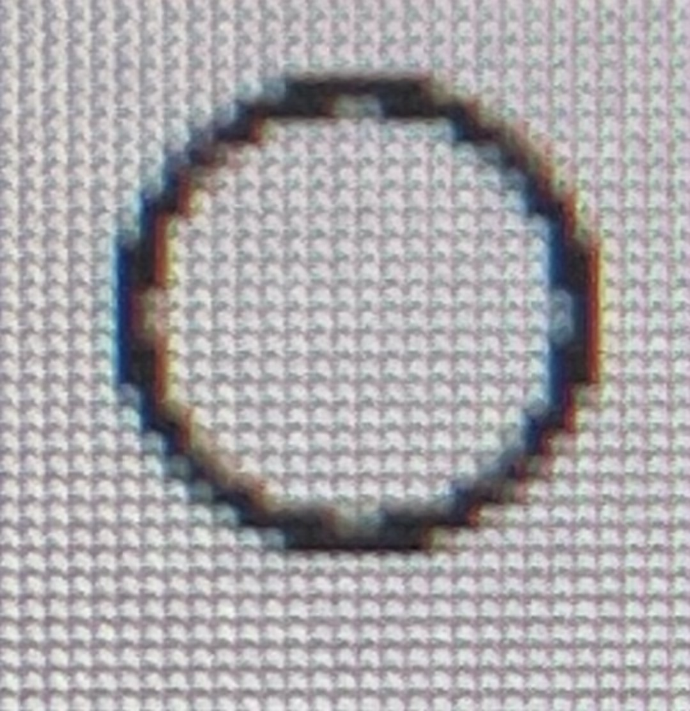
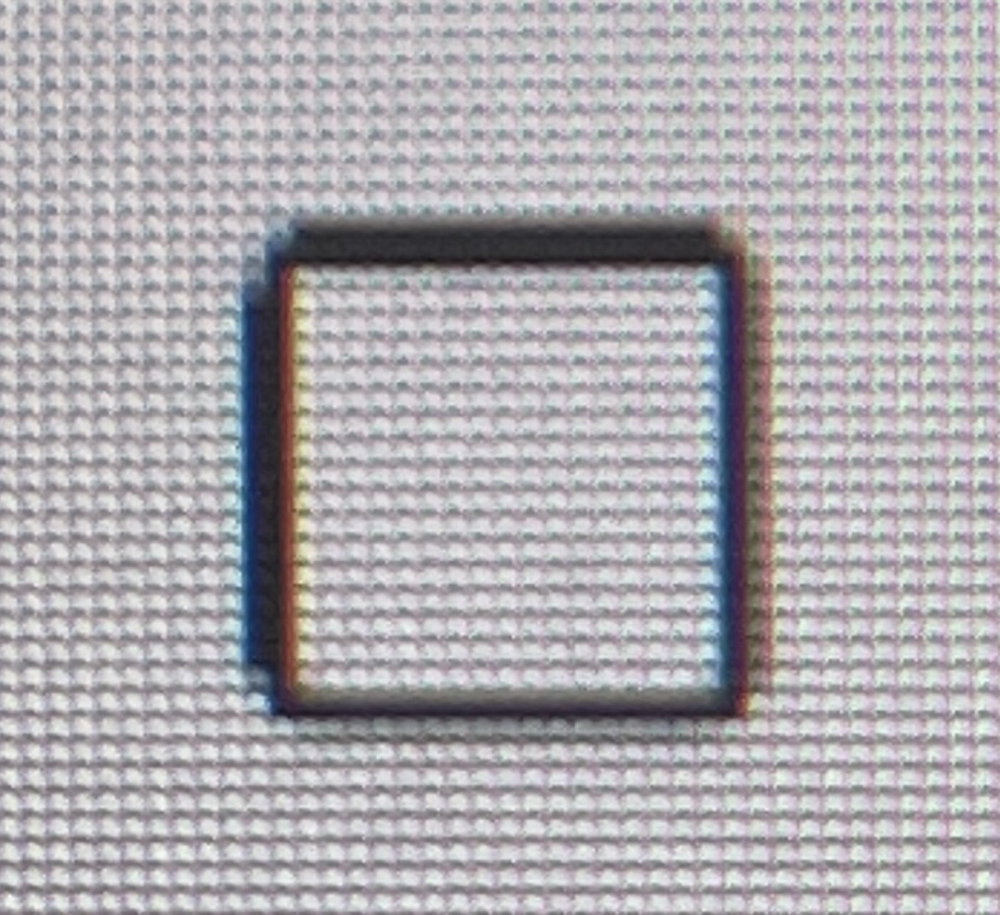
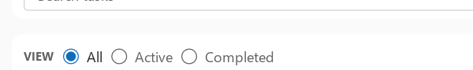
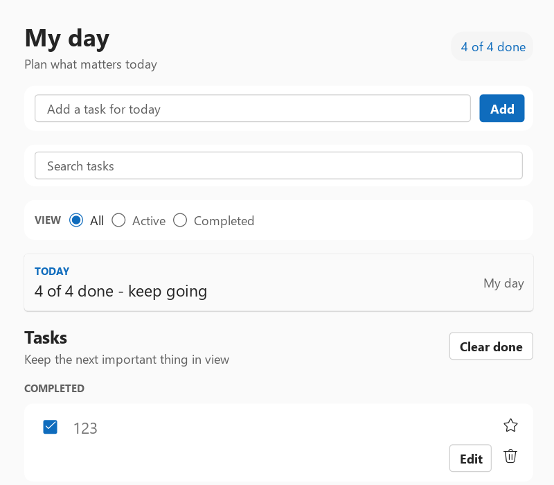
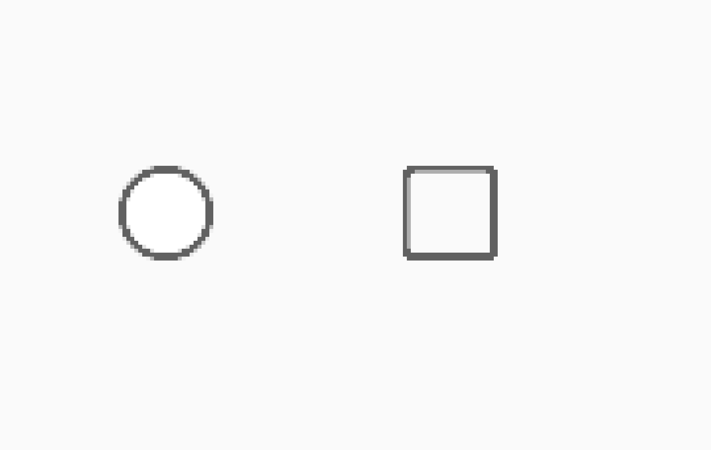
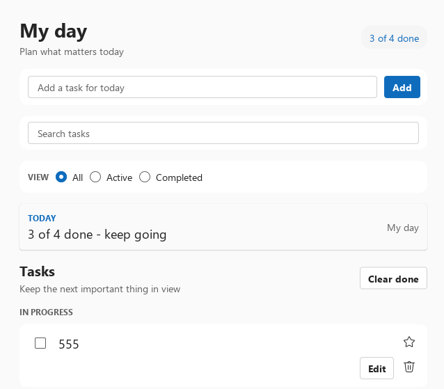
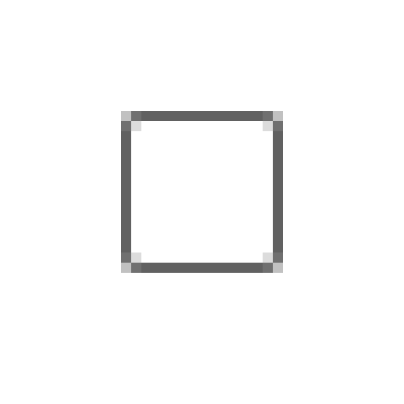

# Fluent indicator geometry at fractional DPI

## Problem record

On a 4K Windows display at 150% scale, the unchecked Radio and Checkbox
indicators exposed two related visual defects:

- the Radio outline had long flat chords and visible direction changes, so it
  read as a polygon instead of a circle;
- the Checkbox corners and opposite edges did not carry visually even ink,
  making the small frame look coarse and slightly asymmetric.

The defects are visible in these monitor photographs:





The colored fringe and screen-door pattern in these photographs come partly
from photographing the LCD subpixel grid. They are not the acceptance signal.
The long Radio chords, discontinuous curvature, unequal edge mass, and
clipping are geometry signals and remain visible independently of the camera
moire.

## Root causes

### Curve subdivision ignored the final device scale

WhatsCanvas generated Circle, Oval, and rounded-rectangle paths in local
coordinates, then applied the Canvas root transform. The old curve subdivision
heuristics only inspected the local radius:

- an ellipse used `circumference * 0.25`, with a 16-segment minimum;
- each rounded-rectangle quadrant used `ceil(radius * 0.35)`, with a
  four-segment minimum.

The native GLFW host configures 150% scale through
`Canvas::setDevicePixelRatio(1.5)`. Curve tessellation therefore saw an
8-10 DIP radius before the root transform, while the framebuffer saw a
12-15-pixel radius afterwards. A 16-segment circle at a 15-pixel physical
radius has a chord sagitta of approximately 0.288 pixel:

```text
error = radius * (1 - cos(pi / segments))
      = 15 * (1 - cos(pi / 16))
      ~= 0.288 px
```

That error is large enough to expose flat edges on a compact, high-contrast
indicator. Antialiasing can soften a chord edge, but it cannot turn insufficient
geometry into a circle.

The 150% Checkbox also uses a legitimate 1 DIP Fluent stroke, which maps to
1.5 physical pixels. Fractional coverage is expected and must not be "fixed"
by silently turning every border into a one-physical-pixel hairline. The
requirement is symmetric coverage and continuous corners, not an integer
number of fully opaque pixels.

### The analytic-AA fringe overlapped fully covered geometry

The first fix removed Radio facets, but `build.bat` could still show a heavy,
dirty Checkbox edge. The executable was current:

```text
build.bat
  -> build-todo
  -> examples/Release/WhatsUITodoGlfw.exe
  -> WhatsCanvas OpenGL backend
```

The misleading result came from backend coverage, not from a stale binary.
The first indicator regression used only the deterministic Software backend,
while the native Todo uses OpenGL.

WhatsCanvas expands a filled or stroked triangle mesh with a one-physical-pixel
coverage fringe. The fringe correctly spans half a pixel inside and half a
pixel outside the mathematical silhouette. The old implementation nevertheless
kept the fully covered interior triangles all the way to that silhouette. The
inner half of the fringe therefore occupied the same pixels as the 100%
interior. Normal `SrcOver` blending composited both fragments:

```text
source alpha 0.5 drawn twice:
result = 0.5 + 0.5 * (1 - 0.5) = 0.75
```

At 150% this made a valid 1 DIP / 1.5-physical-pixel Checkbox border look
roughly like a much heavier stroke. It also made an exact-token pixel test pass
for the wrong reason.

## Solution

### Device-space curve tolerance

WhatsCanvas now includes the current Canvas transform when choosing curve
segments. The required segment count bounds every chord to a maximum
0.1-physical-pixel sagitta:

```text
physicalRadius = logicalRadius * effectiveDeviceScale
maximumStep =
    2 * acos(1 - maximumSagittaPixels / physicalRadius)
segments = ceil(abs(sweepRadians) / maximumStep)
```

The result is combined with the previous circumference heuristic and existing
segment caps. Small UI curves gain only the detail they need; large curves and
the tessellation-cache contract remain bounded.

This matters specifically for the native path: tests must call
`Canvas::setDevicePixelRatio(scale)` and construct
`PaintContext(canvas, scale, true)`. Merely multiplying every coordinate by
1.5 before calling Canvas does not reproduce the original failure.

### Semantic circle primitives

`PaintContext` now exposes `fillCircle`, `strokeCircle`, and
`fillStrokeCircle`. Radio uses these primitives for:

- the selected/unselected outer stroke;
- the compound-brand selected dot.

Both layers share one centre and radius model. Radio no longer relies on a
square rounded rectangle with an oversized "circular" corner token.

### Fluent checked-state composition

The circle primitive fix alone does not make a Fluent Radio. The earlier
checked state used the inverse composition—a solid blue disc with a small
white dot—which was geometrically round but did not match Fluent 2.

The corrected medium Radio follows the official component source:

- 16 DIP indicator box;
- 1 DIP circular outer stroke;
- transparent unchecked centre;
- 10 DIP checked centre dot (`16 * 0.625`);
- transparent 2 DIP annular gap between the dot and outer stroke;
- root-level focus-visible outline for keyboard navigation, rather than extra
  concentric indicator rings or a persistent rectangle after pointer clicks.

The state ramps are intentionally separate. Unchecked borders use
`neutralStrokeAccessible`, `neutralStrokeAccessibleHover`, and
`neutralStrokeAccessiblePressed`. Checked borders use `compoundBrandStroke`;
the dot uses `compoundBrandForeground1`. The compound-brand pressed value is
not interchangeable with the pressed brand surface token.

References:

- [Fluent 2 RadioGroup documentation](https://storybooks.fluentui.dev/react/?path=/docs/components-radiogroup--docs)
- [Fluent Radio style source](https://github.com/microsoft/fluentui/blob/master/packages/react-components/react-radio/library/src/components/Radio/useRadioStyles.styles.ts)

The resulting Todo filter row has the same visible hierarchy as the reference:
the selected control has a blue outer stroke, a white annular gap, and a blue
centre dot; unchecked controls remain transparent.



This is a crop of the real OpenGL Todo framebuffer captured from
`build-todo/examples/Release/WhatsUITodoGlfw.exe`; the complete frame is kept
alongside it for layout-level review:



Checkbox remains a rounded rectangle, as required by Fluent, but benefits from
the device-aware rounded-corner tessellation. Its 16 DIP layout box, hit box,
and 1 DIP stroke token are unchanged.

### Non-overlapping analytic-AA geometry

The fully covered triangles now stop at the fringe's inner boundary. Boundary
vertices use the same quantized indices and mitred inset as the fringe, so the
interior stays watertight while every output pixel is covered by only one
portion of the shape.

The regression renders a translucent rounded rectangle through a hidden real
OpenGL 3.3 context. Before the fix, source alpha 128 reached alpha 192 on 120
pixels. After the fix:

```text
maximum alpha:       128
over-covered pixels: 0
```

The Software golden for the antialiased clipped circle was intentionally
updated as well: the old abrupt/dark edge is replaced by a single smooth
coverage ramp.

## Result

The fixed 150% native-DPR probe is shown at normal size and with nearest-neighbor
pixel enlargement:




At normal size, the Radio reads as a circle and the Checkbox has balanced
edges. In the pixel enlargement, ordinary raster stair steps remain visible;
that is unavoidable for a 24-pixel circle. The acceptance criteria are smooth
radial progression, symmetry, bounded chord error, and no long geometric
facets—not a mathematically continuous edge on a discrete pixel grid.

The final native Todo frame below comes from
`build-todo/examples/Release/WhatsUITodoGlfw.exe`. It is read directly from the
OpenGL framebuffer before presentation, not substituted with a Software render
or desktop screenshot:



The Checkbox enlarged with nearest-neighbor sampling shows one dark physical
stroke row/column plus the intended lighter coverage pixels at the corners,
rather than the previous multiply blended edge:



## Automated acceptance

`WhatsUIFluentIndicatorGeometryTests` renders the real Canvas-DPR ownership
path through the Software backend at 100%, 150%, and 200%. It writes the PPM
artifact before assertions and checks:

- Radio ink exists on 24 radial directions;
- the Radio ink bounds remain centred and circular;
- radial spread is at most 1.25 physical pixels;
- opposite, cardinal, and diagonal samples remain symmetric;
- Checkbox width and height agree within one physical pixel;
- all four Checkbox edges carry comparable ink;
- horizontal and vertical mirror mismatch stay below the documented bound;
- the immediate exterior remains the page token, proving no overflow or clip.

`WhatsCanvasOpenGLAAGeometryTests` complements that widget-level test with a
real OpenGL framebuffer. It asserts that analytic AA never increases a
translucent shape beyond its source alpha. Both tests are required: the first
validates Fluent component geometry and DPR ownership; the second validates
the backend that `build.bat` actually runs.

Run the focused gate with:

```powershell
cmake --build build-native-text-compare --config Release `
  --target WhatsUIFluentIndicatorGeometryTests --parallel 4

ctest --test-dir build-native-text-compare -C Release --output-on-failure `
  -R '^whatsui_fluent_indicator_geometry_(100|150|200)dpi$'
```

The broader regression set remains:

```powershell
ctest --test-dir build-native-text-compare -C Release --output-on-failure `
  -R '^whatsui_fluent_(component_visual_matrix|component_visual_matrix_150dpi|range_controls_visual|range_controls_visual_150dpi|radio_visual_(100|125|150|200)dpi|visual_acceptance|visual_acceptance_125dpi|visual_acceptance_150dpi|visual_acceptance_200dpi)$'
```

## Files and ownership

- WhatsCanvas owns device-aware Circle/Oval/rounded-rectangle subdivision in
  `src/canvas/Canvas.cpp`.
- WhatsCanvas also owns non-overlapping analytic-AA mesh expansion in
  `src/canvas/Canvas.cpp` and its OpenGL regression in
  `tests/OpenGLAAGeometryTests.cpp`.
- WhatsUI owns backend-neutral circle drawing in
  `include/wui/paint_context.h`.
- Radio composition remains in
  `src/whatsui/widgets/basic_controls.cpp`.
- The dedicated regression is
  `tests/fluent_indicator_geometry_tests.cpp`.
- Radio state composition is locked separately by
  `tests/fluent_radio_visual_tests.cpp` at 100%, 125%, 150%, and 200%.

Do not solve future indicator defects by increasing a global fixed segment
count, disabling antialiasing, or snapping every logical stroke to one physical
pixel. Measure the final device-space geometry, preserve the design token, and
add a local pixel assertion that reproduces the failing DPR path.
