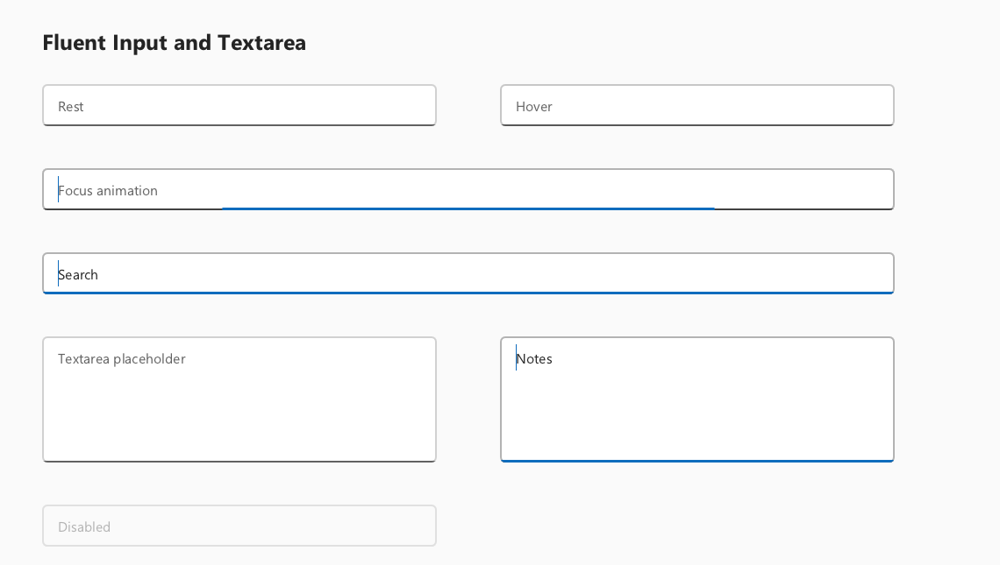

# Fluent Input and Textarea visual contract

WhatsUI follows the Fluent UI React v9 field construction rather than treating
an editable control as a generic rounded rectangle.

## Official references

- <https://storybooks.fluentui.dev/react/?path=/docs/components-input--docs>
- <https://storybooks.fluentui.dev/react/?path=/docs/components-textarea--docs>
- <https://github.com/microsoft/fluentui/blob/master/packages/react-components/react-input/library/src/components/Input/useInputStyles.styles.ts>
- <https://github.com/microsoft/fluentui/blob/master/packages/react-components/react-textarea/library/src/components/Textarea/useTextareaStyles.styles.ts>

## Outline and state layers

- The outline appearance uses `neutralStroke1` on the outer frame and
  `neutralStrokeAccessible` on its bottom edge. Hover and pressed/focused
  states resolve the corresponding semantic aliases; a literal black line is
  not embedded in the widget.
- Focus adds a separate 2 DIP `compoundBrandStroke` bottom indicator. It
  expands from the horizontal centre over `durationNormal` (200 ms) with a
  decelerating curve. Focus-out uses `durationUltraFast` (50 ms) and an
  accelerating curve.
- The bottom indicator is clipped to the complete rounded field silhouette.
  This preserves the lower corner shape and removes the square “horns” caused
  by painting an inset rectangle.
- Straight outline and bottom-stroke edges are snapped to complete physical
  pixels. At 150%, the 1-DIP neutral stroke resolves to 2 physical pixels and
  the 2-DIP focus indicator resolves to 3 physical pixels; neither is left as
  a soft 1.5-pixel coverage.
- `setMotionEnabled(false)` is the reduced-motion and deterministic-capture
  path. It applies the target focus state immediately.
- Disabled fields use a transparent surface and `neutralStrokeDisabled`.
  Invalid fields show the danger stroke only while focus is outside, matching
  Fluent's `:not(:focus-within)` rule.

## Content and caret geometry

- Medium Input horizontal content padding is 12 DIP.
- Medium Textarea content padding is 12 DIP horizontally and 6 DIP vertically.
- The visible caret follows the 20 DIP Body 1 line box. It does not fill the
  complete 32 DIP Input or the complete Textarea viewport.
- Caret x/top/bottom coordinates are snapped to the framebuffer pixel grid and
  its visible width is exactly one physical pixel at 100%, 125%, 150%, and
  200%. The public IME caret rectangle retains logical coordinates and the
  same line-height geometry.
- IME composition underline edges and thickness use the same physical-pixel
  snapping, preventing a one-DIP underline from becoming a soft fractional
  stroke at 150%.

## Automated visual proof

`WhatsUIFluentInputTextareaVisualTests` captures rest, hover, focus-in,
focused, Textarea, and disabled states at 100%, 125%, 150%, and 200%. It
asserts semantic stroke colors, focus expansion width, integer-snapped focus
and resting stroke thickness,
one-physical-pixel caret width, 20 DIP caret height, vertical centring, and
Textarea padding.

