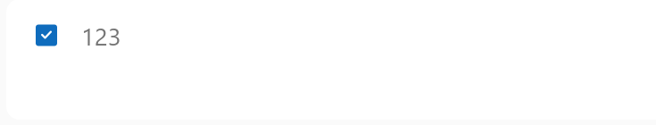
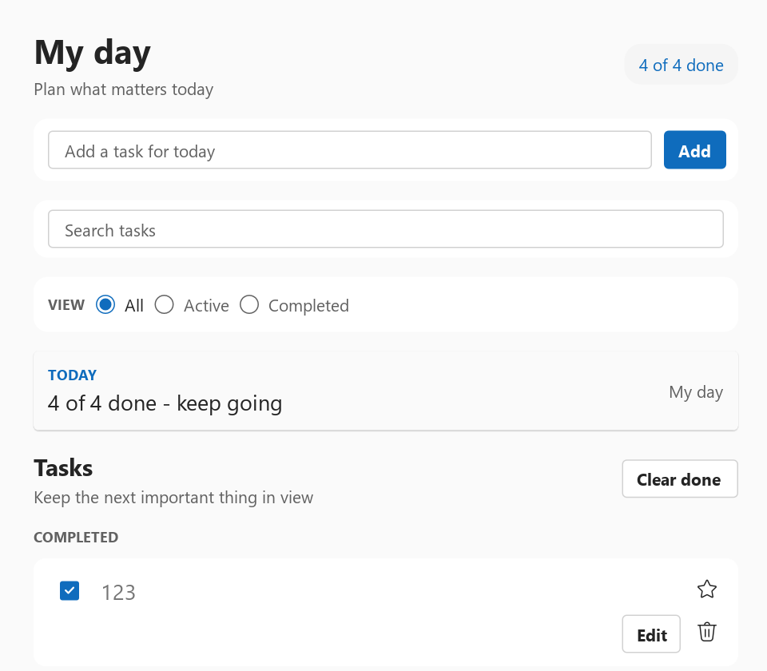

# Fluent selection, range, media, and rating controls

This note records the Fluent UI React v9 behavior used by WhatsUI for the
Divider, Slider, ProgressBar, Checkbox, RadioGroup, Switch, Image, Rating, and
RatingDisplay completion batch. It is an implementation contract, not a copy
of the React API: C++ names may differ, but observable behavior and semantics
must remain equivalent.

## Official references

- <https://storybooks.fluentui.dev/react/?path=/docs/components-divider--docs>
- <https://storybooks.fluentui.dev/react/?path=/docs/components-slider--docs>
- <https://storybooks.fluentui.dev/react/?path=/docs/components-progressbar--docs>
- <https://storybooks.fluentui.dev/react/?path=/docs/components-checkbox--docs>
- <https://storybooks.fluentui.dev/react/?path=/docs/components-radiogroup--docs>
- <https://storybooks.fluentui.dev/react/?path=/docs/components-switch--docs>
- <https://storybooks.fluentui.dev/react/?path=/docs/components-image--docs>
- <https://storybooks.fluentui.dev/react/?path=/docs/components-rating--docs>
- <https://storybooks.fluentui.dev/react/?path=/docs/components-ratingdisplay--docs>

## Component contracts

### Divider

- Supports horizontal and vertical separators, optional content, start/center/end
  content alignment, inset lines, and default/subtle/brand/strong appearances.
- Content must interrupt the line cleanly without overlap. An unlabelled divider
  remains a separator in the accessibility tree.

### Slider

- Supports controlled and uncontrolled values, clamping, step snapping,
  horizontal and vertical orientation, and small/medium sizing.
- Small uses a 16 DIP thumb, 5 DIP inner radius, 2 DIP rail, and a 24 DIP
  minimum cross-axis hit area. Medium uses a 20 DIP thumb, 6 DIP inner radius,
  4 DIP rail, and a 32 DIP minimum cross-axis hit area.
- The thumb uses a white inset equal to 20% of its diameter and a one-physical-
  pixel outline. The rail, thumb centre, and outline thickness are snapped
  once in final framebuffer space at fractional DPR.
- Pointer drag and keyboard arrows, Home, and End must use the same normalization
  path. The vertical maximum is at the top.
- The accessibility value is writable only while the control is enabled.

### ProgressBar

- A supplied value produces determinate progress; indeterminate mode omits a
  numeric value and exposes a busy operation instead.
- Rounded/square shapes, medium/large thickness, and
  brand/error/warning/success colors use theme tokens.
- Reduced-motion mode must yield a stable, non-animated indicator.

### Checkbox

- Supports unchecked, checked, and mixed states; square/circular shapes;
  medium/large sizes; labels before/after; required and disabled states.
- Medium uses a 16 DIP indicator with a 2 DIP corner radius and the dedicated
  12 DIP filled checkmark glyph. Large uses a 20 DIP indicator and 16 DIP
  glyph.
- The medium 16 DIP indicator is centred inside a 32 DIP leading hit slot.
  Label-after starts after that slot plus the Fluent horizontal-XS gap.
- The icon font's em box is not the checkmark's visible ink box. Checkbox
  applies a 1 DIP downward optical correction so the mark itself, rather than
  only its font metrics, is vertically centred; this removes the 1.5 px
  upward error visible at Windows 150% scaling.
- Checked surfaces use `compoundBrandBackground` for rest, hover, and pressed;
  the pressed state must not reuse the darker Button surface token.
- Mixed keeps a transparent face with `compoundBrandStroke` and a matching
  compound-brand square/circle mark. It is not the checked blue face with an
  inverse white dash.
- Unchecked label and border states progress from neutral foreground/stroke
  rest to hover and pressed aliases. Disabled indicators remain transparent
  with disabled border, mark, and label tokens.
- Pointer focus remains logical and keyboard-operable without painting a black
  rectangle. The root focus outline is shown only for keyboard focus-visible.
- A wrapped label aligns the indicator with the first text line. The complete
  label and indicator form one hit target.
- Mixed state maps to the native indeterminate Toggle state.

The final OpenGL Todo capture shows the corrected medium checked state without
the pointer-focus border and with the 12 DIP Fluent mark:

The crop comes from this complete native OpenGL framebuffer:

### RadioGroup

- The group, rather than individual Radio controls, owns exclusive selection,
  controlled binding, and arrow-key movement.
- Vertical, horizontal, and horizontal-stacked layouts are supported. Disabled
  options are skipped by keyboard movement.
- The medium indicator follows Fluent's exact 16 DIP composition: a 1 DIP
  circular outer stroke, transparent interior, and—when checked—a 10 DIP
  compound-brand centre dot. The 2 DIP annular gap between dot and stroke
  remains transparent; the selected state is not a solid brand disc with a
  white dot.
- The 10 DIP dot is implemented as the official 16 DIP pseudo-element scaled
  by `0.625`, retaining one shared centre through rasterization. Fluent uses
  this construction specifically to avoid 125% DPI rounding errors.
- Like Checkbox, the indicator occupies a centred 16 DIP box inside a 32 DIP
  leading hit slot. The label begins after that slot plus the horizontal-XS
  gap, so measure, paint, pointer hit testing, and keyboard focus share one
  geometry.
- Unchecked border states use `neutralStrokeAccessible`,
  `neutralStrokeAccessibleHover`, and `neutralStrokeAccessiblePressed`.
  Checked border/dot states use the separate compound-brand stroke/foreground
  ramps. Disabled states use the disabled neutral tokens.
- Use two to five concise choices. If selection is optional, represent it as an
  explicit “None” choice rather than silently clearing a required group.

### Switch

- A switch changes state immediately; use Checkbox for choices that are only
  committed on form submission.
- Supports small/medium sizes and before/above/after label placement. Required,
  disabled, focus, hover, and pressed states stay visually distinct.
- Medium is a 40×20 DIP track with an 18 DIP thumb and 20 DIP travel. Small is
  a 32×16 DIP track with a 14 DIP thumb and 16 DIP travel. The thumb geometry
  is identical in off/on states; only its position and state tokens change.
- The track is centred inside an 8 DIP horizontal hit margin on each side, so
  an unlabeled Medium Switch measures 56 DIP wide and Small measures 48 DIP.
- The Medium keyboard-focus variant keeps the exact 56×36 DIP root. Its
  4-DIP corner and white 3-DIP / black 2-DIP guard strokes are painted inside
  that root; the focus treatment must not expand to 60×40 or allow the 40×20
  track to protrude through a constrained diagnostic frame.
- The complete label and indicator form one hit target and expose Toggle
  semantics.

### Image

- Preserves source interning and intrinsic sizing while supporting
  default/none/center/fill/contain/cover fit, square/circular/rounded shapes,
  borders, shadows, and block layout.
- Informative images require concise contextual alternative text. Decorative
  images are omitted from the accessibility tree.
- Shape clipping applies to the image itself and never clips the border or
  elevation outside the image bounds.

### Rating

- Interactive Rating supports controlled/uncontrolled values, configurable
  maximum, whole/half steps, clear-to-zero behavior, four sizes, and
  neutral/brand/marigold colors.
- Pointer preview is transient; committing by pointer, keyboard, or accessibility
  uses the same clamp/snap/change-notification path.
- Each possible value needs a meaningful accessible label; the aggregate control
  also exposes its current value.

### RatingDisplay

- RatingDisplay is passive aggregate output, never an input replacement.
- It rounds visual fill to the nearest half item, optionally shows a localized
  count, supports compact one-item mode, and shares Rating sizes/colors/icons.
- A visible RatingDisplay always has a value and a non-empty generated accessible
  name. No-value content is represented by omitting the component from the view.

## Verification contract

- Dedicated tests cover value/state transitions, bindings, keyboard and pointer
  input, disabled behavior, and accessibility actions.
- A unified Software-backend matrix is rendered at DPR 1.0 and 1.5. Review checks
  circular geometry, baseline alignment, focus boundaries, half fills, image
  clipping, vertical extrema, and disabled-state contrast.
- Release build, all `whatsui_` CTest targets, and `git diff --check` are the final
  gate. The tracked checklist is
  [FLUENT_SELECTION_MEDIA_RATING_TODOS.md](FLUENT_SELECTION_MEDIA_RATING_TODOS.md).
