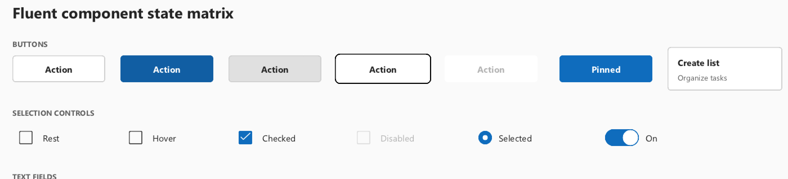
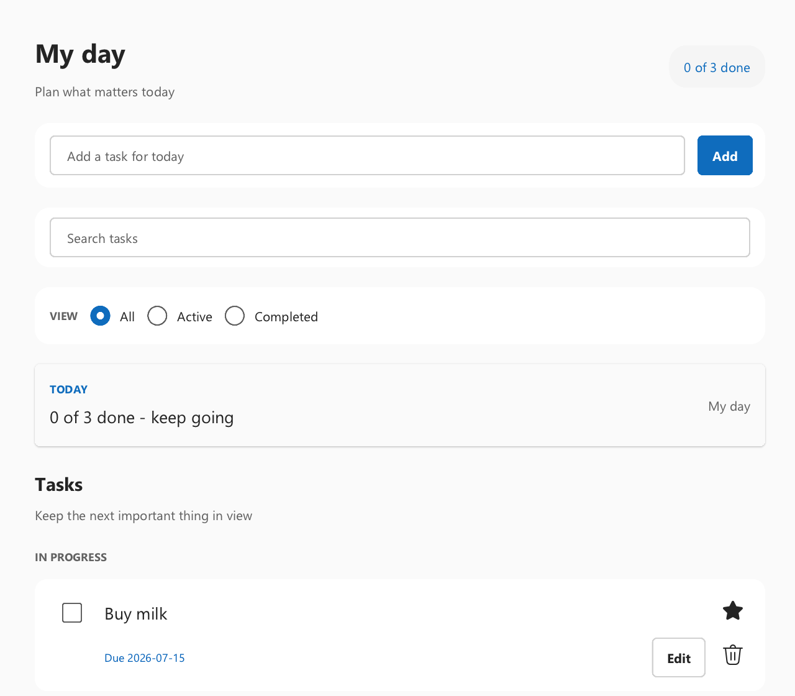
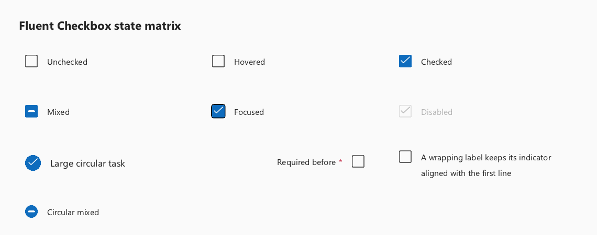
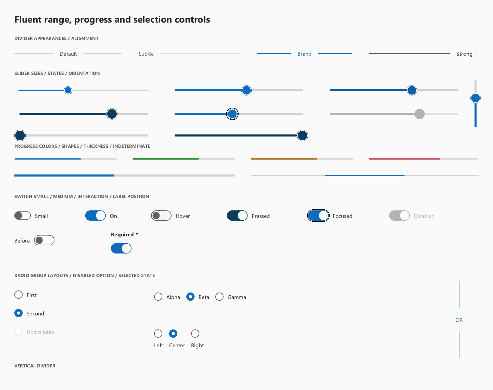
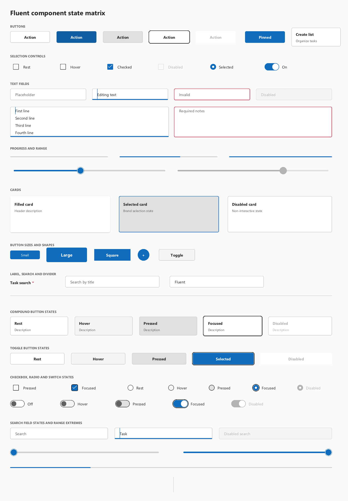

# Fluent control text alignment postmortem

Status: fixed, guarded, and visually reviewed on 2026-07-19.

Scope: shared WhatsUI text placement, Fluent controls, and the Todo reference
application. This is a follow-up to
[Windows text rendering postmortem](../WINDOWS_TEXT_RENDERING_POSTMORTEM.md):
the earlier incident was primarily about raster sharpness, DPR, ClearType
coverage, and font weight; this incident was about baseline placement after the
glyph itself had become sharp.

## Summary

Buttons, inputs, selection labels, task rows, and status text could look
visibly misaligned even though their layout boxes were numerically centred.
The shared helper used the measured line height as if the complete line box sat
above the typographic baseline:

```text
wrong draw y = control centre + measured line height / 2
```

That incorrectly treats the complete line height as ascent magnitude, ignoring
descent and line gap. Segoe UI and the portable WhatsCanvas face both have a
real descent, so 14-DIP Fluent labels were pushed down by roughly 3–4 DIP
inside common 32-DIP controls.

The fix centres the font's ascent/descent box, normalizing the sign difference
between the portable and DirectWrite metric conventions:

```text
A = abs(raw ascent) / S
D = abs(raw descent) / S

baseline = control centre + (A - D) / 2
```

Coordinates increase downward. `A` and `D` are the logical ascent and descent
magnitudes, and `S` is `PaintContext::canvasCoordinateScale()`:

| Canvas ownership | `S` | Reason |
|---|---:|---|
| Canvas already owns `setDevicePixelRatio(DPR)` | `1` | Canvas performs the logical-to-device transform; forwarding DPR again would double-scale. |
| Caller submits pre-scaled Canvas coordinates and text size | `DPR` | Backend metrics are physical and must be divided back to logical units. |

For an empty string or unavailable/zero backend metrics, the helper uses a
deterministic `0.8em` ascent and `0.2em` descent fallback. The value being
centred is the font ascent/descent box, not the per-string visible ink bounds.
Rendered ink is measured separately by the acceptance test.

This is now the single shared path used by Button, ToggleButton,
CompoundButton, Input, TextArea, SearchField, Checkbox/Radio labels, and other
single-line Fluent surfaces.

## Text-quality work completed in the same batch

The baseline fix was the final layer of a broader text-quality correction. All
of the following changes are required for the current result; treating any one
of them as “the font fix” is incomplete.

### Fluent Windows type ramp

The default theme now expresses the Windows Fluent roles rather than relying
on scattered application literals:

| Role | Size / line height | Typical use |
|---|---:|---|
| Caption | 12 / 16 DIP | Section labels and compact metadata |
| Body | 14 / 20 DIP | Controls, descriptions, and standard labels |
| Body large | 18 / 24 DIP | Todo summaries and primary row titles |
| Subtitle | 20 / 28 DIP | Section headings |
| Title | 28 / 36 DIP | Page title |

Todo and shared widgets consume these tokens. Button labels use the theme's
semibold button weight instead of inheriting an accidentally thin regular
face.

### Font-family routing and fallback

- The Windows preference is `Segoe UI Variable`, with `Segoe UI` as the stable
  fallback on systems where the variable family is unavailable.
- The portable backend registers platform font files under stable WhatsCanvas
  aliases. `PaintContext::resolvedTextFamily()` maps only theme-owned Windows
  defaults to those aliases; an explicit application-registered custom family
  remains untouched.
- DirectWrite retries `Segoe UI` when creating a text format for
  `Segoe UI Variable` fails. This prevents missing text or an unrelated serif
  fallback on older Windows images.

### Measurement, paint, and cache identity

- Font family, size, weight, and slant now travel together through measurement,
  line layout, baseline placement, and draw calls.
- CompoundButton measurement and paint use the same family and weight.
- WhatsUI's measurement cache distinguishes the complete text style.
- The portable WhatsCanvas glyph-atlas key now includes the resolved face's
  weight and slant. Without those fields, rendering regular after bold could
  overwrite or incorrectly reuse the same atlas entry, making labels appear
  randomly thin.

### One-DPR ownership

Layout stays in logical DIPs. The backend rasterizes at physical size once, and
the Canvas coordinate scale maps the metrics back to logical units once. The
native DirectWrite regression runs at 100%, 125%, 150%, and 200% and checks
that both logical measurement and physical raster bounds follow this contract.
This guards against an application scale followed by a second system scale.

These layers solve different symptoms:

```text
font family + type ramp + weight
    -> correct face, readable size, and intended hierarchy

glyph cache identity + physical DPR rasterization
    -> stable stroke weight and sharp physical pixels

ascent/descent baseline + application row composition
    -> correct control and row alignment
```

## What the defect looked like

The failure was subtle in source code but obvious in a real UI:

- Button labels sat low instead of occupying the optical centre.
- Input placeholder text appeared low relative to the border.
- Checkbox and Radio indicators did not line up with their labels.
- Todo completion indicators did not line up with the primary task title.
- CompoundButton title and description could drift independently.
- A screenshot could look “almost right” while every repeated row amplified
  the same error.

The following crop was captured before the baseline correction:


The same region after the shared metric correction:



## Two independent alignment defects

### 1. Shared typographic baseline calculation

`PaintContext::centeredTextBottom()` previously derived a draw coordinate from
`lineHeight / 2`. That value was then consumed by the WhatsCanvas `BOTTOM`
anchor as a typographic baseline. Line height is not a baseline offset: it can
contain ascent, descent, and line gap, and those portions are not symmetric
around the baseline.

The implementation now exposes `centeredTextBaseline()` and retains
`centeredTextBottom()` only as a compatibility forwarding alias. It also:

- resolves the active theme font family before measurement;
- passes font family and weight consistently to measurement and drawing;
- handles portable negative ascent and DirectWrite positive ascent magnitude;
- divides physical backend metrics by the Canvas coordinate scale exactly
  once.

### 2. Todo task-row composition

The Todo row had a separate local defect. Under their shared top/`Start`
alignment, the completion Checkbox was centred inside a 40-DIP wrapper while
the one-line title/star primary row occupied 32 DIP:

```text
(40 - 32) / 2 = 4 DIP
```

Even with the global baseline fixed, the Checkbox therefore remained four DIPs
below the title centre. The wrapper now matches the 32-DIP primary row. A
4-DIP title inset makes each 24-DIP title line occupy that primary rail, and
the title/action row is top-aligned. For a wrapped two-line title, the
completion indicator and important action therefore align with the first line,
not with the midpoint of the complete two-line text block.

The Todo interaction test covers both cases: the short title shares the
32-DIP primary-row centre, and a forced narrow 360-DIP fixture asserts first-line
alignment for a wrapped long title. These are logical-geometry assertions at
1.0 DPR; the strict four-DPR rendered-ink gate belongs to the shared control
acceptance suite.

The resulting Todo layout:



## Related visual defects fixed during the audit

The alignment review also found two geometry problems that would not have been
caught by text-only assertions:

- Mixed Checkbox used a nested blue square plus a second outline. It now uses
  one coherent brand surface with a centred foreground mark for both square
  and circular shapes.
- Pressed Slider thumbs grew beyond their endpoint paint bounds and could be
  clipped into a flat edge. Enlarged thumb geometry is now clamped inside the
  control at both minimum and maximum.

The reviewed state artifacts are retained with this document:





The complete 150% component matrix:



## Quantitative acceptance

Visual alignment is now measured from rendered ink, not only from nominal node
bounds. The acceptance threshold is one final framebuffer pixel:

```text
logical tolerance = 1 / DPR
```

Measured results for the deterministic Software backend:

| Windows scale | Button centre error | Label centre error | Input centre error |
|---|---:|---:|---:|
| 100% (`1.0`) | 0 px | 0.5 px | 0.5 px |
| 125% (`1.25`) | 0 px | 0.5 px | 0.5 px |
| 150% (`1.5`) | 1 px | 0.5 px | 0.5 px |
| 200% (`2.0`) | 1 px | 1 px | 0.5 px |

The previous draft gate allowed Button/Label displacement of 4 DIP and Input
displacement of 5 DIP. That would have accepted the original defect at every
DPR. Those tolerances were removed. A high-DPI test may not pass merely because
its tolerance is expressed in a visually large logical unit.

## Regression protection

The following layers protect the fix:

| Test | Protection |
|---|---|
| `whatsui_fluent_visual_acceptance` | Rendered ink, input inset, circular geometry, and state-token samples at 100%. |
| `whatsui_fluent_visual_acceptance_125dpi` | The same rules at fractional 125%. |
| `whatsui_fluent_visual_acceptance_150dpi` | The same rules at the target Windows 150% environment. |
| `whatsui_fluent_visual_acceptance_200dpi` | The same rules with a tightened 0.5-DIP/one-pixel band. |
| `whatsui_fluent_component_visual_matrix*` | Broad component/state review plus Button, ToggleButton, Input, TextArea, SearchField, and CompoundButton ink checks. |
| `whatsui_fluent_checkbox_completion*` | Checked/mixed geometry, mark centring, circular corners, focus, and accessibility. |
| `whatsui_fluent_range_controls_visual*` | Slider endpoint clipping and Progress/Radio/Switch geometry. |
| `whatsui_todo_ui_interaction_smoke_tests` | Real Todo tree alignment between completion indicator and task title. |
| `whatsui_windows_native_text_dpi_tests` | DirectWrite/native font metrics and exactly-one-DPR ownership at 100/125/150/200%. |

The full Release build and serial CTest suite passed `128/128` after the fix.
The suite is intentionally run serially for final sign-off because some
WhatsCanvas script tests invoke MSBuild internally and can contend for the same
`.tlog` files under parallel CTest.

Run the strict visual and native-text gates:

```powershell
cmake -S . -B build-fluent-typography-review `
  -DWHATSUI_WITH_WHATSCANVAS=ON `
  -DWHATSUI_BUILD_TESTS=ON `
  -DWHATSUI_BUILD_EXAMPLES=ON `
  -DWHATSUI_ENABLE_ADVANCED_TEXT=ON `
  -DWHATSCANVAS_BUILD_SOFTWARE=ON `
  -DWHATSCANVAS_BUILD_OPENGL=ON `
  -DWHATSCANVAS_ENABLE_FREETYPE_RASTERIZER=ON

cmake --build build-fluent-typography-review --config Release -j 8

ctest --test-dir build-fluent-typography-review -C Release --output-on-failure `
  -R '^(whatsui_fluent_visual_acceptance(_(125|150|200)dpi)?|whatsui_fluent_component_visual_matrix(_150dpi)?|whatsui_windows_native_text_dpi_tests|whatsui_todo_ui_interaction_smoke_tests)$'
```

Run final Release sign-off without the nested-MSBuild `.tlog` race:

```powershell
ctest --test-dir build-fluent-typography-review -C Release --output-on-failure -j 1
```

The reproducible source anchor is the parent commit containing this document
and its recorded `third_party/WhatsCanvas` gitlink. Generated artifacts are
written under `build-fluent-typography-review/tests/`, including
`fluent_visual_acceptance*.ppm` and
`fluent_component_visual_matrix_150dpi.ppm`.

## Review rules learned

1. A centred layout box does not prove centred glyph ink.
2. `lineHeight`, glyph bounds, ascent/descent, and baseline are different
   quantities and must not be substituted for one another.
3. Backend metric sign conventions must be normalized at the adapter boundary.
4. Font family, size, weight, and DPR must be identical in measurement and
   paint.
5. Inspect both shared primitives and application composition. A global fix can
   reveal a second local offset.
6. Use final physical pixels for visual thresholds. A fixed 4-DIP tolerance is
   not pixel-level acceptance.
7. Save the review image before assertions so CI failures remain inspectable.
8. Every visual defect needs a localized semantic-pixel or geometry assertion;
   a whole-image hash alone does not explain a failure.
9. Always inspect the generated 150% matrix after rendering changes. Automated
   assertions cannot judge hierarchy, crowding, or overall composition.
10. Keep coverage claims precise: shared controls have a four-DPR rendered-pixel
    gate; Todo composition has focused logical alignment plus responsive image
    review; GLFW content-scale callbacks and cross-monitor movement remain
    native release checks.

The normative release checklist is
[Fluent visual quality gates](FLUENT_VISUAL_QUALITY_GATES.md). Typography roles
and baseline alignment follow the
[Fluent 2 typography guidance](https://fluent2.microsoft.design/typography).

## Relevant implementation

| File | Responsibility |
|---|---|
| `include/wui/paint_context.h` | Metric normalization and shared centred baseline. |
| `include/wui/whatscanvas_text.h` | Family/weight-aware measurement and DPR conversion. |
| `include/wui/theme.h`, `src/whatsui/core/theme.cpp` | Fluent Windows type ramp, family, weight, and line-height defaults. |
| `src/whatsui/widgets/button.cpp` | Button/CompoundButton/Checkbox/Radio labels and mixed-state geometry. |
| `src/whatsui/widgets/text_input.cpp` | Input/TextArea viewport, placeholder, text, selection, and caret. |
| `src/whatsui/widgets/basic_controls.cpp` | Slider/Progress/Switch geometry and endpoint clamping. |
| `examples/todo_app/main.cpp` | Todo typography tokens and task-row composition. |
| `tests/fluent_visual_acceptance_tests.cpp` | Strict four-DPR semantic-pixel acceptance. |
| `tests/fluent_component_visual_matrix_tests.cpp` | Broad rendered component state matrix. |
| `tests/todo_ui_interaction_smoke_tests.cpp` | Todo-specific row-centre regression. |
| `third_party/WhatsCanvas/src/text/BasicTextBackend.cpp` | Glyph-atlas face identity, including weight and slant. |
| `third_party/WhatsCanvas/src/text/DirectWriteTextBackend.cpp` | Segoe UI Variable to Segoe UI fallback. |
